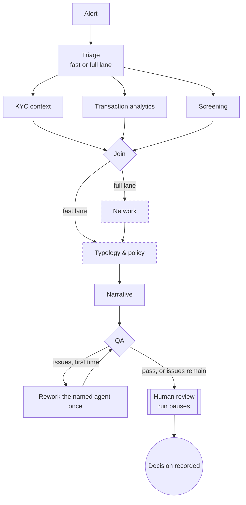

# Sentinel

**A multi-agent AI system that investigates anti-money-laundering (AML) alerts and prepares the evidence, so human investigators can make the decision.**

Sentinel is built on [LangGraph](https://langchain-ai.github.io/langgraph/). A squad of specialist AI agents gathers evidence about an alert from several sources. They analyse it and write a case narrative in which every claim cites its evidence. The system checks its own work, then pauses for a human investigator to decide whether to close the case, escalate it or ask the customer for more information.

> All data in this repository is synthetic. No real customers, accounts or institutions are represented.

---

## Problem statement

Banks run transaction-monitoring systems that raise alerts when activity looks unusual. Examples include cash deposits kept just below a reporting threshold, money passing straight through an account, or a customer resembling a name on a sanctions list. Each alert must be investigated and documented, and regulators expect this to be done promptly and consistently.

In practice this work is slow and expensive:

- **Most of an investigator's time goes on gathering evidence, not judging it.** One alert can mean looking up a customer's profile, transaction history, sanctions and PEP lists, adverse news and internal notes. These often sit in many separate systems.
- **Alert volumes are high, and most alerts are false positives.** Skilled investigators spend much of their day ruling out harmless activity.
- **Quality is uneven.** Write-ups vary between investigators, and QA teams can usually review only a small sample of cases.
- **Delay carries risk.** Red flags handled slowly or inconsistently expose a bank to financial crime and to regulatory penalties.

## Solution

Sentinel automates the **evidence-gathering and drafting** part of an investigation and keeps **every decision with legal weight in human hands**.

For each alert, Sentinel:

1. **Receives the alert** from the transaction-monitoring stream (Kafka) and starts one durable, checkpointed investigation per case.
2. **Triages** the alert into a fast or a full investigation lane, using deterministic business rules.
3. **Gathers evidence in parallel** with specialist agents for customer context (KYC), transactions and screening. Each agent uses fixed, read-only tools, and a policy engine authorises every call.
4. **Drafts a narrative** in which every factual claim cites an evidence ID that a tool actually returned.
5. **Checks its own work**: code guards verify citations and completeness, and a failed check sends the work back for one rework.
6. **Pauses for a human investigator**, who reviews the evidence pack and recommendation, then decides: *close*, *escalate* or *request information*. The decision comes back on the stream and completes the case.

### Why an agentic system?

- **Investigations are open-ended.** Which records matter depends on what the previous lookup showed. Agents with tools can follow the evidence, where a fixed script cannot.
- **The work splits naturally into specialisms.** KYC, transaction analysis and screening need different data and different expertise. Separate agents keep each one focused, testable and replaceable, and they can run in parallel.
- **Control still matters.** The overall workflow is a *fixed* graph that auditors can review. Autonomy is confined to each specialist's inner tool loop, and no agent has a tool that can close a case, file a report or change customer data.

### What Sentinel does not do

- It never closes, escalates or files a suspicious activity report itself. No agent has a tool that can.
- It never changes customer data.
- It never writes free-form SQL or graph queries. All data access goes through fixed, parameterised tools.
- It never presents a claim without an evidence ID that exists in the case.

---

## Current status

Sentinel is being built in thin end-to-end slices, each tested before the next widens it.

**Working today**
- The **end-to-end flow** from a Kafka alert to the investigator's decision. Case state is saved in Postgres, so paused cases survive restarts. Duplicate alerts and late decisions are handled safely, and messages that keep failing go to a dead-letter queue.
- **Six graph steps**: triage (rules), KYC context, transaction analytics, screening, narrative, and QA code checks with one rework loop.
- **Tools behind MCP servers.** Each agent gets only its own tools, every call is authorised by an OPA policy, and every request is scoped to the case's legal entity.
- A **synthetic dataset** with planted typologies and known outcomes, loaded into Postgres.
- **Batch evaluation** against those known outcomes. On a 20-case sample spanning every typology, every recommendation was correct and every claim cited real evidence.
- **Tests:** offline, integration (Docker stack) and live (Bedrock), plus a Streamlit test console for developers.

**Planned**
- The Network agent (graph database) and the Typology & policy agent (searchable policy knowledge base).
- An LLM QA critic.
- PII and prompt-injection guardrails.
- Approval steps for high-impact tool calls and customer follow-up requests.
- Scheduled batch jobs (Airflow).
- An API and the React investigator workbench.
- Observability.
- Deployment to AWS.

---

## Agentic system design



*Dashed boxes are planned. Until the Typology & policy agent is added, the specialists' findings go straight to the Narrative agent, which makes the recommendation.*

Each case is one run of a LangGraph `StateGraph`. The run is checkpointed, so it can pause for days at human review and resume exactly where it stopped. Shared case state collects evidence and findings from every agent. Its merge rules (reducers) let parallel agents write at the same time and let a reworked agent replace, rather than duplicate, its earlier output.

### The agents

| Agent | What it does | Why it is needed | Status |
|---|---|---|---|
| **Triage** | Applies business rules to choose the fast or full lane. The full lane is forced for high-risk customers, sanctions indications, large amounts, repeat alerts, network scenarios or multiple customers. | Routine alerts get proportionate effort and high-risk ones get a deep investigation. Rules come first, so the lane is predictable and auditable. | Implemented (rules); LLM lane upgrade planned |
| **KYC context** | Reads the customer profile, relationship notes and prior case history, compares the alerted activity with expected activity, and lists discrepancies. | Activity is only suspicious relative to who the customer is. A note such as "customer is selling their car" can explain a large credit. | Implemented |
| **Transaction analytics** | Uses deterministic detectors (structuring, pass-through, velocity, cash ratio, distinct senders) and reviews the transactions, reporting red flags with transaction IDs. | Patterns such as repeated deposits just under a threshold are the core of many typologies. Detector tools keep the numbers reproducible. | Implemented |
| **Screening** | Fuzzy-matches the customer against sanctions and PEP lists and searches adverse media. It decides true or false matches using date of birth, nationality and context. | Name matches are noisy. Most hits are near-misses that must be ruled out with reasons, while a true match changes the case outcome. | Implemented |
| **Network** *(full lane)* | Expands counterparties and shared devices in a graph database and scores mule-ring risk. | Some laundering only shows up across many accounts, not within one customer. | Planned |
| **Typology & policy** | Maps the findings to AML typologies and the relevant internal procedure, citing policy versions. | Recommendations must rest on documented policy, not on model opinion. | Planned (the narrative recommends for now) |
| **Narrative** | Writes the case summary and claims, each citing evidence IDs, plus a recommendation, reason code and open questions. | Investigators need a clear, consistent write-up that they can check line by line against the evidence. | Implemented |
| **QA critic** | Checks completeness and citations and can send work back to a named agent once. If issues remain, they go to the human with the issues attached. | Every case gets automated QA, not a small sample, and a weak case never reaches the investigator silently. | Code checks implemented; LLM critic (a different model from the narrative) planned |

### Design principles

- **Humans decide.** Every disposition is a LangGraph `interrupt`. Agents only recommend.
- **Impossible, not discouraged.** Dangerous actions have no tool at all. A deny-by-default policy engine (Open Policy Agent) authorises every remaining tool call: the right agent, the right tool, the case's legal entity, and arguments within limits.
- **Tools are the only data path.** Agents read data only through fixed, parameterised tools served by MCP (Model Context Protocol) servers. Each agent loads only the tools for its role, the servers check a service token, and every request is scoped to the case's legal entity.
- **Fixed outer graph, free inner loop.** The workflow is deterministic. Autonomy lives only inside each specialist's tool loop, which has a step limit.
- **Every claim has evidence.** Evidence is collected from what tools actually returned, not from what a model says it found. A code guard rejects any claim citing an unknown ID.
- **Tool output is data, not instructions.** Prompts tell agents to ignore instructions embedded in records. Injection and PII guardrails are planned.
- **Auditability.** Every run records the prompt and model version of each agent.

---

## Tech stack

| Area | Technology | Status |
|---|---|---|
| Agent orchestration | LangGraph (`StateGraph`, checkpointer, `interrupt`), LangChain `create_agent` | In use |
| Models | AWS Bedrock via `langchain-aws` (`ChatBedrockConverse`); DeepSeek V3.2 by default, configurable per agent | In use |
| Structured outputs | Pydantic schemas for every agent | In use |
| Name screening | RapidFuzz fuzzy matching | In use |
| Tools layer | MCP servers (FastMCP, Streamable HTTP) + `langchain-mcp-adapters`; dev JWT service tokens | In use |
| Authorisation | Open Policy Agent (Rego, deny by default, per agent, tool and legal entity) | In use |
| Data store | PostgreSQL (pgvector image) for customers, transactions, lists, alerts and case history | In use |
| Synthetic data | Seeded generator (Faker) with planted typologies and ground truth | In use |
| Evaluation | Batch runner scoring escalation recall, false escalations and citation validity against ground truth | In use |
| Local stack | Docker Compose | In use |
| Language & tooling | Python, pytest (offline, integration and live suites), pydantic-settings | In use |
| Test console | Streamlit (developer tool only, not deployed) | In use |
| Event streaming | Apache Kafka (KRaft) + Kafka UI: alerts in, decisions back, case events out, dead-letter queue; `aiokafka` workers; MSK IAM auth switch for AWS | In use |
| Durable runs | LangGraph `AsyncPostgresSaver`: cases pause for days at human review and survive restarts | In use |
| Scheduling | Apache Airflow (list refreshes, graph rebuilds, alert replay) | Planned |
| More data stores | pgvector policy search, Neo4j + GDS (networks) | Planned |
| Documents | Docling (policy manuals → searchable chunks) | Planned |
| Guardrails | Presidio (PII), prompt-injection rails | Planned |
| API & UI | FastAPI service, React investigator workbench | Planned |
| Evaluation tooling | DeepEval, Promptfoo, LangSmith experiments | Planned |
| Observability | OpenTelemetry, Tempo, Prometheus, Grafana, LangSmith (development only) | Planned |
| Cloud | AWS: ECS Fargate, MSK Serverless, Aurora Serverless v2, Bedrock | Planned |

---

## Getting started

**Prerequisites:** Python 3.11+ and an AWS account with Bedrock model access (DeepSeek V3.2 by default) in the configured region.

```bash
python -m venv .svenv
# Windows: .svenv\Scripts\activate    macOS/Linux: source .svenv/bin/activate
pip install -r requirements.txt
pip install -e .
aws login            # or any standard AWS credential method
```

Settings can be overridden with environment variables or a `.env` file, for example `SENTINEL_AWS_REGION` and `SENTINEL_MODEL_NARRATIVE`. See [src/sentinel/config.py](src/sentinel/config.py).

### Two ways to run

| Mode | What runs | Setup |
|---|---|---|
| **In-process** (default) | Tools run inside the agent process on JSON datasets. No Docker needed. | Nothing extra |
| **Full stack** | Postgres, Kafka, OPA and four MCP tool servers in Docker; agents call tools over MCP, and OPA authorises every call | See below |

```bash
docker compose up -d --build     # Postgres, Kafka + UI (localhost:8080), OPA, MCP servers
cp .env.example .env             # data=postgres, tools=mcp, OPA on, local Kafka
sentinel data generate           # synthetic dataset -> data/generated/dataset.json
sentinel data load               # fixtures + generated dataset -> Postgres
sentinel kafka init              # create the topics
```

The generator is seeded, so every run produces the same data. It creates around 300 customers, 18,000 transactions and 85 alerts. Each alert has a planted pattern with a known correct outcome: structuring, pass-through, mule activity, high-risk jurisdictions, true and near-miss sanctions matches, PEPs, and benign look-alikes such as cash-intensive businesses, property sales and bonuses.

### Run an investigation

```bash
# Terminal: runs the alert, shows the evidence pack, asks you for the decision
sentinel run data/fixtures/alerts/CASE-0001.json
sentinel run --case CASE-G0001          # any alert in the data backend

# Test console in the browser
streamlit run devtools/streamlit_app.py
```

### Run through Kafka (as in production)

Alerts arrive on `aml.alerts.v1`. The worker investigates each case, sends progress to `aml.case-events.v1`, and pauses the case at human review, where its saved state in Postgres survives restarts. A decision on `aml.decisions.v1` then resumes the case. Duplicate alerts and late decisions are ignored safely. Messages that keep failing go to the dead-letter queue.

```bash
sentinel worker all --concurrency 4          # terminal 1: alert + decision workers
sentinel kafka tail                          # terminal 2: live case events
sentinel kafka publish --sample 10           # terminal 3: 10 alerts across all typologies
sentinel kafka decide --accept               # accept the recommendation on every case awaiting review
sentinel kafka decide CASE-G0013 --action escalate --reason-code PASS_THROUGH   # or decide one case
```

The workers run on the host because they need your AWS credentials for Bedrock. On AWS they run as containers that get credentials from their task role.

Three hand-written cases are always available:

| Case | Scenario | Expected outcome |
|---|---|---|
| `CASE-0001` | Repeated cash deposits just below the reporting threshold at several branches | Escalate: structuring |
| `CASE-0002` | One large credit with a documented, legitimate purpose | Not escalated |
| `CASE-0003` | Business customer who is a true sanctions-list match | Escalate: sanctions true match |

### Evaluate

```bash
sentinel eval --n 20 --concurrency 4
```

This runs a sample of alerts, spread across every typology, up to the human-review step. It then compares each recommendation with the ground truth and reports:
- **escalation recall:** the share of must-escalate cases the system recommends escalating;
- **false escalation rate;**
- **agreement** with the expected outcome;
- **citation validity:** the share of narratives that cite only real evidence.

A JSON report is written to `evals/results/`.

### Run the tests

```bash
pytest                                  # offline: tools, rules, guards, graph, generator, MCP, policy (no AWS, no Docker)
pytest -m integration                   # against the Docker stack: Postgres parity, OPA, MCP over HTTP, Kafka round trip
docker compose exec opa /opa test /policies -v      # Rego policy unit tests
SENTINEL_LIVE=1 pytest -m live          # end to end against Bedrock, including the test console
```

---

## Repository structure

```text
src/sentinel/
├── graph.py          # workflow: triage → specialists (parallel) → narrative → QA → human review
├── state.py          # shared case state and merge rules
├── agents/           # triage, kyc, txn, screening, narrative, qa + shared agent factory and briefs
├── tools/            # read-only tool functions, per-agent allow-list, MCP client
├── middleware/       # OPA authorisation of every tool call
├── repo/             # data access: JSON datasets or Postgres, same interface
├── datagen/          # seeded synthetic data generator, Postgres schema and loader
├── guards/           # citation and completeness checks
├── hitl.py           # human-review interrupt and decision validation
├── schemas/          # Pydantic outputs and decision reason codes
├── prompts/          # versioned system prompts
├── events.py         # Kafka message schemas (alerts, decisions, case events)
├── kafka.py          # Kafka clients (local or MSK IAM), topics
├── workers.py        # alert and decision workers
├── persistence.py    # Postgres checkpointer and case status
├── evaluate.py       # batch evaluation against ground truth
└── cli.py            # `sentinel run | data | eval | kafka | worker`
mcp_servers/          # FastMCP servers (case_mgmt, kyc_profile, txn_history, screening) + Dockerfile
guardrails/opa/       # Rego policy, agent tool allow-list, policy tests
docker-compose.yml    # local stack: Postgres, Kafka + UI, OPA, MCP servers
devtools/             # Streamlit test console (developer tool)
data/fixtures/        # hand-written synthetic cases
tests/                # offline, integration and live test suites
docs/                 # design documents
```

---

## Disclaimer

Sentinel is a learning and portfolio project. It is not a production compliance system, it does not give legal or regulatory advice, and its outputs must not be used to make real decisions about real people.

## License

Released under the [MIT License](LICENSE).
