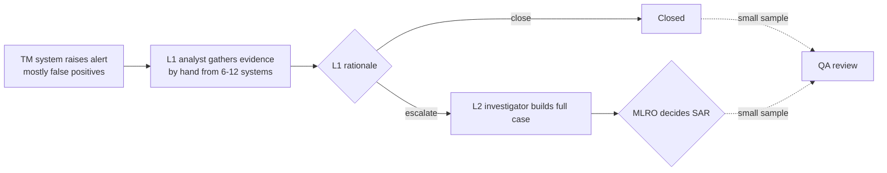
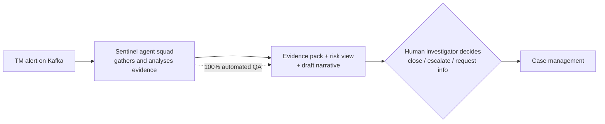
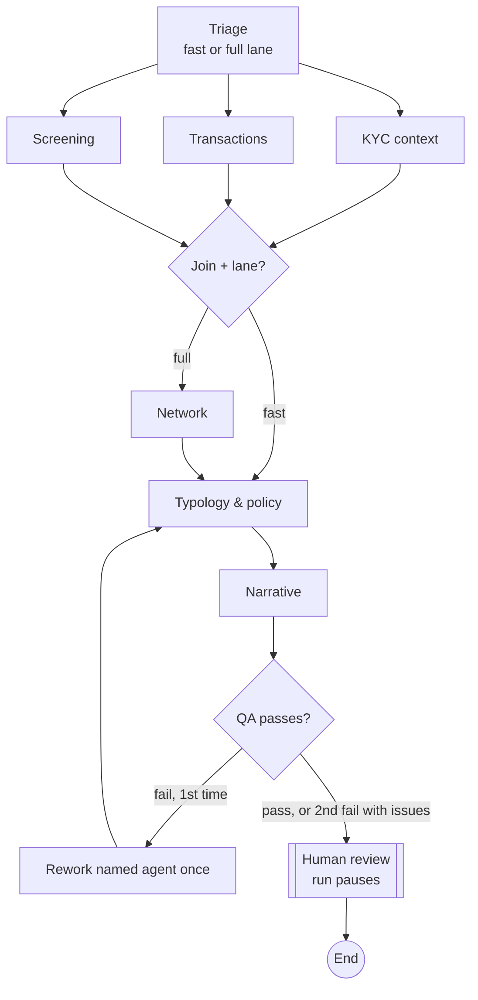
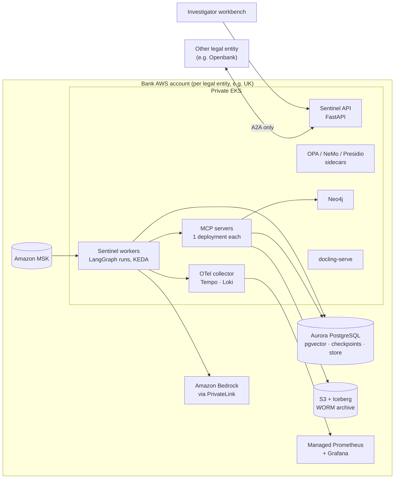

# Sentinel — High-Level Design (HLD)

**Multi-Agent AML Investigation Platform on LangGraph**

| Item | Value |
|---|---|
| Document | 01 — High-Level Design |
| Version | 0.1 (Draft) |
| Author | Rakesh Velayudhan |
| Source | *Sentinel on LangGraph: Multi-Agent AML Investigation Platform* (reference design by Kumar Verma) |
| Related | [02 Technical Design](02_Technical_Design.md) · [03 Functional Specification](03_Functional_Specification.md) · [04 Roadmap](04_Project_Roadmap.md) · [05 Task Plan](05_Project_Task_Plan.md) |

---

## 1. Purpose and scope

This document describes **what** Sentinel is, **why** it exists and **how its major parts fit together**. It covers two scopes:

| Scope | Description | Used for |
|---|---|---|
| **Reference (enterprise) design** | Full platform for a bank like Santander: 8 agents, AWS (EKS, Bedrock, MSK, Aurora, S3), one deployment per legal entity, about 14 people. | Target architecture, so design decisions stay compatible with production. |
| **Project (portfolio) build** | What this project delivers: the same architecture running on **synthetic data**, locally via Docker Compose, with an optional AWS deployment. | Roadmap, task plan and acceptance criteria. |

> Sentinel is a proposal for "a bank like Santander". It is not a description of anything Santander has announced. All data used in this project is synthetic or anonymised.

---

## 2. Business context

### 2.1 Problem

AML investigators spend most of each alert **gathering evidence** across 6–12 systems rather than **judging** it. Banks put up to 10–15% of staff on KYC/AML (McKinsey). Openbank alone processes about 100,000 AML alerts a year. Slow handling of red flags carries regulatory cost: the FCA fined Santander UK £107.8m, citing slow handling of red flags such as automated monitoring alerts.

### 2.2 Current flow (as-is)

### 2.3 Target flow (to-be)

**Key principle:** agents do the evidence gathering. Humans keep **every decision with legal weight**: closing an alert, escalating it and filing a SAR.

### 2.4 Business KPIs (12-month targets, illustrative)

| KPI | Target |
|---|---|
| Investigator time per L1 alert | 50% lower |
| Alerts with a complete evidence pack at first touch | > 95% |
| QA coverage | 100% automated review plus human sampling |
| Missed escalations found in lookback | No increase (**hard release gate**) |
| Agent–investigator agreement rate | Alarm if > 98% (rubber-stamping) or < 80% |
| All-in cost per alert (incl. tokens) | 40% lower |

For the portfolio build, these KPIs are shown on a Grafana business dashboard and measured against the synthetic golden dataset.

---

## 3. Solution overview

Sentinel is a **squad of 8 specialist AI agents** orchestrated by **one fixed LangGraph `StateGraph` per case**. Each alert starts a durable, checkpointed run. The run gathers evidence through read-only tools, drafts a narrative in which every claim carries an evidence ID, checks itself with a QA critic, and then **pauses for a human decision**.

### 3.1 What Sentinel does

- Classifies each alert and chooses a **fast** or **full** investigation lane.
- Pulls KYC context, transactions, screening results and (in the full lane) network/graph context.
- Maps findings to AML typologies and the relevant country procedure, citing policy versions.
- Drafts an L1 rationale or L2 SAR narrative that cites evidence IDs.
- Runs automated QA on 100% of cases, with one rework loop.
- Presents a finished evidence pack in an investigator workbench and resumes when the human decides.

### 3.2 What Sentinel does **not** do

- It never closes, escalates or files a SAR. **No such tool exists** for any agent.
- It never changes customer data.
- It never writes free-form SQL or Cypher. All data access goes through fixed, parameterised tools.
- It never stores customer facts in long-term memory.
- It never sends production data to third-party SaaS (LangSmith is used only for development, on synthetic data).

---

## 4. Guiding principles

| # | Principle | Consequence |
|---|---|---|
| P1 | **Humans decide** | Every disposition is a LangGraph `interrupt`. Agents only recommend. |
| P2 | **Impossible, not discouraged** | Dangerous actions have no tool. Deny-by-default OPA covers the rest. |
| P3 | **Tools are the only data path** | Agents read through MCP servers, never directly from source systems. |
| P4 | **Fixed outer graph, free inner loop** | Auditors review a deterministic graph. Autonomy exists only inside each specialist's tool loop. |
| P5 | **Every claim has evidence** | Narrative claims must cite evidence IDs that exist in state. This is checked by code and then by the QA agent. |
| P6 | **Data stays inside the bank** | Private networking, Bedrock in-region, OpenTelemetry-only tracing in production. |
| P7 | **Evaluation is the release gate** | No prompt, model or tool change ships unless escalation recall and citation coverage hold. |
| P8 | **Open standards, category leaders** | LangGraph, MCP, A2A, OpenTelemetry, OPA. No AWS-only or paid agent platform. |

---

## 5. Logical architecture

Sentinel has six layers. Data flows down to the agents, and every case ends with a person.

```mermaid
flowchart TB
    subgraph L1["1 · Sources"]
        S1[TM system<br/>raises alerts]
        S2[Core banking, KYC<br/>customers & accounts]
        S3[Documents<br/>KYC files, policies]
        S4[Screening vendors<br/>sanctions, PEP, news]
    end
    subgraph L2["2 · Ingestion"]
        I1[Docling<br/>parse docs into chunks]
        I2[Airflow + dbt<br/>nightly lists, baselines, graph]
        I3[Kafka + Debezium<br/>stream alerts & changes]
    end
    subgraph L3["3 · Data & knowledge"]
        D1[Iceberg on S3<br/>curated tables, guarded PII]
        D2[pgvector on Postgres<br/>policy search, state, memory]
        D3[Neo4j + GDS<br/>networks, mule scores]
    end
    subgraph L4["4 · Tools & guardrails"]
        T1[MCP servers - FastMCP<br/>one per system, read-only]
        T2[Open Policy Agent<br/>allow/deny each call]
        T3[NeMo Guardrails + Presidio<br/>injection & PII rails]
    end
    subgraph L5["5 · Agents & models"]
        A1[LangGraph in Sentinel service<br/>Triage → KYC ∥ Txn ∥ Screening → Network → Typology → Narrative → QA → Human]
        A2[Claude on Bedrock<br/>Opus · Sonnet · Haiku]
    end
    subgraph L6["6 · Decide & observe"]
        O1[Investigator workbench<br/>review, decide, resume]
        O2[OpenTelemetry + Tempo<br/>every step traced in-house]
        O3[Prometheus + Grafana<br/>platform & KPI alerts]
    end
    L1 --> L2 --> L3 --> L4 --> L5 --> L6
```

---

## 6. Agent squad

| # | Agent | Job | Model (reference) | Tools (MCP) |
|---|---|---|---|---|
| 1 | **Triage** | Classifies scenario and typology; sets fast/full lane | Claude Haiku 4.5 | tm-alerts, case-history |
| 2 | **KYC context** | Expected vs actual activity, risk rating, business purpose | Claude Sonnet 5.5 | kyc-profile, crm, core-banking |
| 3 | **Transaction analytics** | Velocity, structuring, pass-through, peer comparison | Claude Sonnet 5.5 | txn-history, analytics sandbox |
| 4 | **Screening** | Sanctions/PEP re-screen, adverse media, registries | Claude Haiku 4.5 | sanctions, adverse-media, registry |
| 5 | **Network** (full lane) | Counterparty/device expansion, mule-ring scores | Claude Sonnet 5.5 | graph-query |
| 6 | **Typology & policy** | Maps findings to typologies and the country procedure | Claude Sonnet 5.5 | policy-kb |
| 7 | **Narrative** | Drafts rationale/SAR with an evidence ID behind every claim | Opus 5.5 (L2) / Sonnet 5.5 (L1) | case-mgmt (draft fields only) |
| 8 | **QA critic** | Completeness, citations, policy rules; can send back once | Different model/tier from Narrative | Read-only to all |

**Three human pause points:**
1. Every disposition (`human_review` interrupt).
2. QA failure after one rework, with the issues attached.
3. High-impact tool calls, such as drafting a customer information request (approval middleware).

---

## 7. Technology stack (summary)

| Phase | Reference (AWS) | Portfolio / local equivalent |
|---|---|---|
| Event ingestion | Kafka on Amazon MSK + Debezium CDC | Kafka (KRaft) container; Debezium optional |
| Batch scheduling | Airflow on Amazon MWAA | Python jobs via Makefile; Airflow optional (stretch) |
| Document parsing | Docling (`docling-serve` on EKS) | Docling Python library |
| Data lake | S3 + Iceberg + dbt, Athena | Postgres "lake" schema (repository interface allows Iceberg later) |
| Vector search | pgvector on Aurora PostgreSQL | Postgres 16 + pgvector container |
| Graph analytics | Neo4j + GDS (EKS or AuraDB) | Neo4j Community + GDS container |
| Orchestration | LangGraph 1.2 + LangChain `create_agent` | Same |
| Models | Claude Opus 5.5 / Sonnet 5.5 / Haiku 4.5 on Bedrock via `langchain-aws` | Bedrock (preferred); Anthropic API as a config fallback |
| Tools | MCP servers (FastMCP) + `langchain-mcp-adapters` | Same |
| Agent interop | A2A Python SDK | Stretch goal |
| Memory | `PostgresSaver` + `PostgresStore` | Same |
| Guardrails | LangChain middleware, NeMo Guardrails, Presidio, OPA | Same (OPA container) |
| Serving | FastAPI + Kafka workers on EKS, KEDA | FastAPI + worker processes (Docker Compose) |
| Dev workbench | LangSmith Developer (free) | Same, synthetic data only |
| Evaluation | DeepEval, Ragas, Promptfoo, LangSmith | Same |
| Observability | LangSmith SDK OTel-only → OTel Collector → Tempo/Loki | Same containers |
| Monitoring | Amazon Managed Prometheus + Grafana | Prometheus + Grafana containers |
| CI/CD | GitHub Actions, Terraform, Helm, Argo CD | GitHub Actions; Terraform/Helm as stretch |
| UI | React investigator workbench | Same |

---

## 8. Deployment view (high level)

- **One deployment per legal entity** keeps data in its jurisdiction. A2A is the only path between entities.
- **No outbound path to LangSmith from production.** The egress firewall blocks it.
- **Local build:** the same services run in Docker Compose. Bedrock is reached over the public endpoint using a developer account.

---

## 9. Security, privacy and compliance (overview)

| Risk | Control |
|---|---|
| PII sent to a model unnecessarily | Presidio + LangChain PII middleware redact before the call; data is restored only in the UI |
| Prompt injection in news, payment references or documents | Tool output treated as data; NeMo input rails |
| Tipping off the customer; legal conclusions | NeMo output rails; Pydantic-validated structured outputs |
| Agent calling a forbidden tool | Deny-by-default OPA via `@wrap_tool_call`; no write tools |
| Invented facts in narrative | Evidence-ID code check + QA agent + human sign-off |
| Runaway loops / cost | Recursion limit, token budgets, per-node timeouts |
| Data exfiltration | Private EKS, PrivateLink to Bedrock, egress allow-list |
| Audit | Checkpoint at every step; trace ID on the case record; WORM S3 archive |

---

## 10. Non-functional requirements (summary)

Full NFR list: [03 Functional Specification §11](03_Functional_Specification.md#11-non-functional-requirements).

| Area | Requirement (portfolio target) |
|---|---|
| Durability | No step lost on worker crash; runs resume from the last checkpoint |
| Latency | Fast lane ≤ 3 min, full lane ≤ 10 min to "awaiting review" (illustrative) |
| Throughput | Reference: ~100k alerts/year/entity (~275/day average, with spikes buffered by Kafka) |
| Auditability | 100% of steps checkpointed; every span tagged with case, entity, lane, prompt version, model |
| Explainability | 100% of narrative claims backed by valid evidence IDs |
| Data residency | Inference in EU regions; no production data leaves the account |
| Cost | Per-case token budget; most steps on Haiku/Sonnet; Bedrock prompt caching |

---

## 11. Stakeholders and users

| Role | Interest |
|---|---|
| L1 analyst | Reviews fast-lane cases; closes or escalates |
| L2 investigator | Reviews full cases and SAR drafts |
| MLRO | Decides on SAR filing (outside Sentinel) |
| QA reviewer | Samples and labels cases; feeds the golden dataset |
| FinCrime SME | Typologies, rubrics, golden dataset |
| Model risk management | Independent validation; approves material changes |
| Security operations | OPA policies, injection alerts |
| Platform / SRE | Runs the service, workers and observability |

---

## 12. Assumptions, constraints and dependencies

**Assumptions**
- The project is a portfolio/course build. All customer data is synthetic and generated by the project.
- Access to Claude models via Amazon Bedrock (or the Anthropic API as a fallback) is available.
- A single developer working with an AI pair-programmer. Timeline: 7 days, Day 1 to Day 7 (see [04 Roadmap](04_Project_Roadmap.md)).

**Constraints**
- The LangSmith free plan allows 1 seat, 5,000 traces a month and 14-day retention, for synthetic data only.
- `mcp` Python SDK v2 (new protocol revision) is a breaking change. Pin `mcp` and `langchain-mcp-adapters`.
- Start on LangGraph 1.x (the 0.4 line is leaving maintenance).

**Dependencies**
- Docker / Docker Compose, Python 3.12, Node 20+ for the UI, AWS account (optional for deployment).

---

## 13. Key risks (top 6)

| Risk | Mitigation |
|---|---|
| Hallucinated facts in narratives | Evidence-ID check, QA critic, human sign-off |
| Rubber-stamping by investigators | Agreement-rate alarm (> 98%), blind cases with no draft |
| Prompt injection via external content | Input rails, no write tools, deny-by-default OPA |
| Library churn (LangGraph, MCP SDK) | Pin versions, thin wrappers, quarterly upgrades |
| Operating the runtime without a managed platform | Small service; Postgres checkpointer for durability |
| Scope creep in a solo project | Gated phases; portfolio scope first, stretch goals later |

---

## 14. Project scope (portfolio build)

**In scope (MVP)**
- Synthetic data generator (customers, accounts, transactions, devices, mule rings, sanctions/PEP lists, adverse media, policies).
- MCP servers: `case_mgmt`, `kyc_profile`, `txn_history`, `screening` (MVP), then `graph_query` and `policy_kb`.
- LangGraph with Triage, KYC, Transactions, Screening, Narrative + QA (MVP), then Network and Typology (full squad).
- Human-in-the-loop with durable Postgres checkpoints.
- OPA policy that **visibly blocks a disposition attempt**.
- FastAPI service, Kafka worker and React workbench.
- Evaluation: golden dataset, DeepEval in CI, Ragas, Promptfoo, LangSmith experiment as a release gate.
- Observability: OTel → Tempo, Prometheus + Grafana dashboards.

**Stretch**
- Airflow DAGs, Debezium CDC, Iceberg, A2A cross-entity check, Terraform/Helm on AWS EKS, LiteLLM proxy.

**Out of scope**
- Real customer data, integration with real bank systems, SAR filing to regulators.

---

## 15. Glossary

| Term | Meaning |
|---|---|
| AML | Anti-money laundering |
| TM | Transaction monitoring |
| KYC | Know your customer |
| PEP | Politically exposed person |
| SAR | Suspicious activity report |
| MLRO | Money laundering reporting officer |
| Typology | A known money-laundering pattern (e.g. structuring, mule ring) |
| Fast / full lane | Light vs comprehensive investigation path chosen by Triage |
| MCP | Model Context Protocol, an open standard for tool servers |
| A2A | Agent-to-Agent protocol, for agents across teams or entities |
| OPA | Open Policy Agent, policy-as-code engine |
| HITL | Human-in-the-loop |
| Golden dataset | Labelled cases used as the evaluation baseline |
