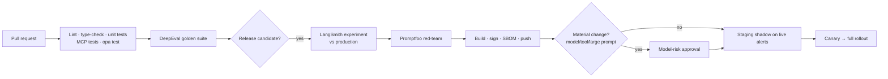
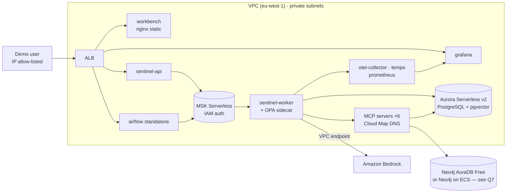

# Sentinel — Technical Design Document (TDD)

| Item | Value |
|---|---|
| Document | 02 — Technical Design |
| Version | 0.1 (Draft) |
| Author | Rakesh Velayudhan |
| Related | [01 HLD](01_High_Level_Design.md) · [03 Functional Spec](03_Functional_Specification.md) · [04 Roadmap](04_Project_Roadmap.md) · [05 Task Plan](05_Project_Task_Plan.md) |

> **Convention:** **[REF]** marks reference (enterprise/AWS) behaviour. **[LOCAL]** marks the portfolio build running under Docker Compose. Where nothing is marked, both are the same.

---

## 1. Component catalogue

| ID | Component | Tech | Responsibility |
|---|---|---|---|
| C01 | Alert producer | Python script [LOCAL] / TM system [REF] | Publishes alerts to `aml.alerts.v1` |
| C02 | Kafka | Kafka KRaft [LOCAL] / Amazon MSK [REF] | Alert and decision topics, buffering |
| C03 | Sentinel worker | Python, `aiokafka`, LangGraph | One graph run per alert; applies human decisions |
| C04 | Sentinel API | FastAPI | Start / get state / resume / SSE stream |
| C05 | Agent graph | LangGraph 1.2 `StateGraph` | Fixed orchestration of 8 agents + human review |
| C06 | Specialist agents | LangChain `create_agent` | Tool loop + structured output per specialist |
| C07 | MCP servers | FastMCP, Streamable HTTP | Read-only access to each data domain |
| C08 | OPA | Open Policy Agent | Allow/deny per agent, tool and arguments |
| C09 | Guardrails | Presidio, NeMo Guardrails, LangChain middleware | PII redaction; input/output rails |
| C10 | Operational DB | Postgres 16 + pgvector [LOCAL] / Aurora [REF] | Checkpoints, store, policy vectors, case data, lake tables [LOCAL] |
| C11 | Graph DB | Neo4j 5 + GDS | Customer/account/device/counterparty graph |
| C12 | Ingestion jobs | Python + Docling (+ Airflow stretch) | Load synthetic data, parse and embed policies, compute graph scores |
| C13 | Workbench | React + TypeScript (Vite) | Case queue, evidence pack, decision capture |
| C14 | Observability | OTel Collector, Tempo, Loki, Prometheus, Grafana | Traces, logs, metrics, dashboards, alerts |
| C15 | Evaluation | DeepEval, Ragas, Promptfoo, LangSmith | Release gates, red-teaming |
| C16 | Model gateway | Bedrock via `langchain-aws` | Claude Opus 5.5 / Sonnet 5.5 / Haiku 4.5 |

---

## 2. Repository structure

```text
sentinel/
├── pyproject.toml              # uv-managed; pinned langgraph, langchain, langchain-aws,
│                               # langchain-mcp-adapters, mcp, langsmith[otel], fastmcp
├── docker-compose.yml          # [LOCAL] full stack
├── Makefile                    # make up / seed / test / eval / demo
├── src/sentinel/
│   ├── config.py               # pydantic-settings; model IDs, endpoints, budgets
│   ├── api/                    # FastAPI: start case, get state, resume, SSE stream
│   ├── workers/                # Kafka consumers (alerts, decisions)
│   ├── graph.py                # StateGraph wiring + checkpointer
│   ├── state.py                # CaseState, Evidence, reducers
│   ├── agents/                 # one create_agent per specialist
│   │   ├── factory.py          # shared builder (model, tools, middleware, schema)
│   │   ├── triage.py kyc.py txn.py screening.py
│   │   └── network.py typology.py narrative.py qa.py
│   ├── schemas/                # Pydantic outputs carrying evidence IDs
│   ├── prompts/                # prompt files (*.md) with version header
│   ├── middleware/             # OPA authorisation, PII, audit tags, budgets
│   ├── guards/                 # evidence-ID checker, NeMo integration
│   ├── tools/mcp_clients.py    # MultiServerMCPClient config per agent
│   ├── a2a/                    # [stretch] A2A wrapper
│   └── memory/                 # store namespaces, lessons writer
├── mcp_servers/                # FastMCP, one package per server
│   ├── case_mgmt/ kyc_profile/ txn_history/ screening/
│   └── graph_query/ policy_kb/
├── data/
│   ├── generator/              # synthetic customers, txns, mule rings, lists
│   └── policies/               # synthetic policy manuals and typology guides
├── ingestion/
│   ├── load_synthetic.py       # seed Postgres + Neo4j
│   ├── docling/                # parse + chunk + embed policies
│   ├── graph_scores.py         # GDS Louvain / WCC / degree → node props
│   └── airflow/dags/           # [stretch]
├── guardrails/
│   ├── nemo/                   # rails config (Colang)
│   └── opa/                    # Rego policies + tests
├── evals/
│   ├── datasets/               # golden + synthetic cases (no real PII)
│   ├── deepeval/ ragas/ promptfoo/
│   └── langsmith_slice.py
├── ui/workbench/               # React app
├── infra/
│   ├── terraform/ helm/        # [stretch / REF]
│   └── otel/ grafana/ prometheus/  # [LOCAL] configs
├── observability/grafana/      # dashboards (JSON) + alert rules
└── .github/workflows/          # ci, eval-gate, redteam, deploy
```

---

## 3. Data architecture

### 3.1 Kafka topics

| Topic | Key | Producer | Consumer | Purpose |
|---|---|---|---|---|
| `aml.alerts.v1` | `case_id` | TM system / generator | Sentinel worker (alerts group) | Start a case |
| `aml.decisions.v1` | `case_id` | Sentinel API | Sentinel worker (decisions group) | Resume a paused run with the human decision |
| `aml.case-events.v1` | `case_id` | Sentinel worker | API (SSE fan-out), audit sink | Live progress events |
| `aml.alerts.dlq.v1` | `case_id` | Worker | Ops | Poison messages |

Partitioning by `case_id` guarantees per-case ordering. **Design decision:** the API does not call `graph.ainvoke(Command(resume=...))` directly. It publishes to `aml.decisions.v1`, so alert processing and resume for the same case are serialised through one consumer path (see §15).

### 3.2 Alert event schema (`aml.alerts.v1`, JSON Schema / Avro equivalent)

```json
{
  "case_id": "CASE-000123",
  "alert_id": "TM-889120",
  "legal_entity": "UK",
  "customer_id": "CUST-00042",
  "account_ids": ["ACC-1001", "ACC-1002"],
  "scenario_code": "TM-STRUCT-01",
  "scenario_name": "Cash deposits below reporting threshold",
  "score": 0.82,
  "triggered_at": "<ISO-8601 UTC timestamp>",
  "lookback_days": 90,
  "triggering_txn_ids": ["TXN-77812", "TXN-77819"],
  "schema_version": "1.0"
}
```

### 3.3 Relational model ([LOCAL] Postgres schemas)

| Schema.table | Key columns | Notes |
|---|---|---|
| `core.customers` | customer_id, legal_entity, name*, dob*, nationality, segment, risk_rating, occupation, business_purpose, onboarded_at | `*` = PII columns, Presidio-tagged |
| `core.accounts` | account_id, customer_id, product, currency, opened_at, status | |
| `core.expected_activity` | customer_id, monthly_in, monthly_out, cash_pct, countries[] | KYC declared profile |
| `crm.notes` | note_id, customer_id, created_at, text | Free text (injection test surface) |
| `lake.transactions` | txn_id, account_id, ts, amount, currency, direction, channel, counterparty_id, counterparty_country, reference | Partitioned by month |
| `lake.peer_baselines` | segment, metric, p50, p90, p99 | Rebuilt by batch job |
| `screening.sanctions_list` | entry_id, name, aliases[], dob, country, list_name | Synthetic |
| `screening.pep_list` | entry_id, name, role, country, level | Synthetic |
| `screening.adverse_media` | article_id, entity_name, published_at, source, text, sentiment | Synthetic; some contain injection payloads |
| `screening.registry` | company_id, name, directors[], ubo[], country | Synthetic |
| `cases.alerts` | case_id, alert JSON, status, assigned_to, trace_id | Case-management system |
| `cases.history` | customer_id, case_id, disposition, closed_at | Prior alerts |
| `cases.drafts` | case_id, version, narrative, claims JSON, created_by_agent | **Only table agents can write** |
| `cases.decisions` | case_id, action, investigator_id, edits, decided_at | Written by API only |
| `cases.qa_labels` | case_id, reviewer_id, label, rubric_scores JSON | QA sampling |
| `sentinel.checkpoints*` | — | Created by `AsyncPostgresSaver.setup()` |
| `sentinel.store*` | — | Created by `AsyncPostgresStore.setup()` |
| `kb.policy_chunks` | chunk_id, doc_id, policy_version, legal_entity, country, typology[], section_path, text, embedding vector(1024), tsv tsvector | Hybrid search |

[REF] `core`, `lake` and `screening` live in Iceberg on S3 (Athena) with column-level access. The `txn_history` MCP server hides storage behind a `TransactionRepository` interface, so swapping Postgres for Iceberg needs no agent change.

### 3.4 Graph model (Neo4j)

```text
(:Customer {customer_id, segment, risk_rating, community_id, mule_score, degree})
(:Account  {account_id, product})
(:Device   {device_id, type})
(:Counterparty {counterparty_id, country, is_external})
(:Customer)-[:OWNS]->(:Account)
(:Customer)-[:USES]->(:Device)
(:Account)-[:TRANSFERRED {txn_id, amount, ts}]->(:Account|:Counterparty)
```

Nightly/batch `graph_scores.py` runs GDS algorithms and writes the results as node properties:
- **WCC** for connected components → `component_id`
- **Louvain** for communities → `community_id`
- **Shared-device count** and **fan-in/fan-out degree** → inputs to `mule_score` (0–1, rule-weighted)

### 3.5 Synthetic data generator

`data/generator/` produces a reproducible dataset (fixed seed) with **planted typologies**, so each generated alert has a known ground-truth disposition:

| Typology code | Pattern planted | Expected disposition |
|---|---|---|
| `STRUCT` | Repeated cash deposits just below threshold | Escalate |
| `PASSTHRU` | Funds in and out within 24–48 h, low balance | Escalate |
| `MULE_RING` | 5–15 customers sharing devices, fan-in → fan-out | Escalate (full lane) |
| `HRJ` | Flows to/from high-risk jurisdictions inconsistent with profile | Escalate / request info |
| `SANCT_NEAR` | Counterparty fuzzy-matches a sanctions entry (true and false matches) | Escalate (true) / close (false) |
| `PEP` | Customer or director is a PEP with unexplained wealth | Escalate / request info |
| `BENIGN_*` | Salary spikes, property sale, seasonal business | Close (false positive) |
| `TBML` *(stretch)* | Over/under-invoiced trade payments | Escalate |

Target: ~1,000 customers, ~200k transactions, ~600 alerts (≈ 65% benign, matching the real-world false-positive skew).

---

## 4. Knowledge and retrieval design

| Step | Choice | Detail |
|---|---|---|
| Parsing | Docling (`DocumentConverter`) | Policy PDFs/DOCX/MD → `DoclingDocument` |
| Chunking | Docling `HybridChunker` via `langchain-docling` loader | Structure-aware; a clause stays whole; max ~512 tokens |
| Metadata | `legal_entity`, `country`, `policy_version`, `typology[]`, `section_path`, `doc_id` | Attached to every chunk |
| Embeddings | Cohere Embed (multilingual) on Bedrock via `langchain-aws` `BedrockEmbeddings` | 1024-d |
| Store | `langchain-postgres` `PGVector` on `kb.policy_chunks` | |
| Hybrid search | Vector top-k=20 ∪ Postgres full-text top-k=20, merged by **Reciprocal Rank Fusion** (k=60) | Implemented in `policy_kb` server |
| Filters | Mandatory `legal_entity` filter; optional `typology` | Each entity's agents see only their procedures |
| Rerank | Cohere Rerank on Bedrock → keep top 5–8 | Cuts tokens and noise |
| Output | Each hit returns `chunk_id`, `policy_version`, `section_path`, `text` | Narrative cites `policy:<doc_id>@<version>#<section>` |

The PII tag from Presidio is stored at ingestion. Policy documents should contain none.

---

## 5. Orchestration (LangGraph)

### 5.1 State — corrected from the reference design

The reference `CaseState` has two defects: (a) `findings: dict` has no reducer, so three parallel agents writing it in the same super-step raise `InvalidUpdateError`; (b) `operator.add` on `evidence` duplicates items when an agent is reworked. Corrected version:

```python
# src/sentinel/state.py
from typing import Annotated, Literal, NotRequired, TypedDict

class Evidence(TypedDict):
    id: str          # "txn:TXN-77812", "doc:sha256:..", "list:OFAC-1234", "policy:AML-UK-07@3.2#4.1"
    source: str      # MCP tool that produced it, e.g. "txn_history.get_transactions"
    agent: str       # agent that collected it
    summary: str

class QAIssue(TypedDict):
    target_agent: Literal["kyc", "txn", "screening", "network", "typology", "narrative"]
    severity: Literal["blocker", "major", "minor"]
    description: str

def merge_evidence(left: list[Evidence], right: list[Evidence]) -> list[Evidence]:
    """Upsert by evidence id so reworked agents replace, not duplicate."""
    merged = {e["id"]: e for e in left or []}
    for e in right or []:
        merged[e["id"]] = e
    return list(merged.values())

def merge_findings(left: dict, right: dict) -> dict:
    """Each agent writes its own key: {"kyc": {...}}, {"txn": {...}}."""
    return {**(left or {}), **(right or {})}

class CaseState(TypedDict):
    case_id: str
    legal_entity: str
    alert: dict
    tier: NotRequired[Literal["fast", "full"]]
    evidence: Annotated[list[Evidence], merge_evidence]
    findings: Annotated[dict, merge_findings]
    narrative: NotRequired[dict]          # NarrativeDraft.model_dump()
    qa_issues: NotRequired[list[QAIssue]] # overwritten each QA round
    qa_rounds: NotRequired[int]
    rework_target: NotRequired[str | None]
    decision: NotRequired[dict | None]    # written ONLY by human_review
    versions: NotRequired[dict]           # prompt/model/policy versions for audit
```

### 5.2 Graph wiring — with a working rework path

The reference sends QA failures "back to the named agent", but the KYC/Txn/Screening nodes feed a **waiting join** (`add_edge([...], "gate")`). A single reworked node would never satisfy that join again. The fix is a dedicated `rework` node that calls the named specialist and then rejoins downstream:

```python
# src/sentinel/graph.py
from langgraph.graph import StateGraph, START, END
from langgraph.types import RetryPolicy

SPECIALISTS = {"kyc": kyc, "txn": txn, "screening": screening,
               "network": network, "typology": typology, "narrative": narrative}
NEXT_AFTER_REWORK = {"kyc": "typology", "txn": "typology", "screening": "typology",
                     "network": "typology", "typology": "narrative", "narrative": "qa"}

async def rework(state: CaseState) -> dict:
    return await SPECIALISTS[state["rework_target"]](state)

def route_after_gate(s: CaseState) -> str:
    return "network" if s["tier"] == "full" else "typology"

def route_after_qa(s: CaseState) -> str:
    if s.get("qa_issues") and s["qa_rounds"] < 2:
        return "rework"                       # one rework only
    return "human_review"                     # pass, or 2nd failure with issues attached

def build_graph():
    g = StateGraph(CaseState)
    retry = RetryPolicy(max_attempts=3)
    for name, fn in [("triage", triage), ("kyc", kyc), ("txn", txn),
                     ("screening", screening), ("network", network),
                     ("typology", typology), ("narrative", narrative),
                     ("qa", qa), ("rework", rework)]:
        g.add_node(name, fn, retry_policy=retry)
    g.add_node("gate", lambda s: {})
    g.add_node("human_review", human_review)   # no retry: interrupt node

    g.add_edge(START, "triage")
    for n in ("kyc", "txn", "screening"):
        g.add_edge("triage", n)                # parallel fan-out
    g.add_edge(["kyc", "txn", "screening"], "gate")   # waits for all three
    g.add_conditional_edges("gate", route_after_gate, ["network", "typology"])
    g.add_edge("network", "typology")
    g.add_edge("typology", "narrative")
    g.add_edge("narrative", "qa")
    g.add_conditional_edges("qa", route_after_qa, ["rework", "human_review"])
    g.add_conditional_edges("rework", lambda s: NEXT_AFTER_REWORK[s["rework_target"]],
                            ["typology", "narrative", "qa"])
    g.add_edge("human_review", END)
    return g
```

`qa` sets `qa_rounds = qa_rounds + 1`, `qa_issues`, and `rework_target` (the highest-severity issue's `target_agent`).

### 5.3 Checkpointer and store (async)

MCP tools are async, so the whole service is async. The sample's sync `PostgresSaver.from_conn_string(...)` is a context manager and is not suitable for a long-lived service. Use a pool instead:

```python
from psycopg_pool import AsyncConnectionPool
from langgraph.checkpoint.postgres.aio import AsyncPostgresSaver
from langgraph.store.postgres.aio import AsyncPostgresStore

pool = AsyncConnectionPool(settings.pg_dsn, max_size=20,
                           kwargs={"autocommit": True, "prepare_threshold": 0})
checkpointer = AsyncPostgresSaver(pool)
store = AsyncPostgresStore(pool, index={"dims": 1024, "embed": embeddings,
                                        "fields": ["lesson"]})
await checkpointer.setup(); await store.setup()       # once, at startup/migration
graph = build_graph().compile(checkpointer=checkpointer, store=store)
```

Run config: `{"configurable": {"thread_id": case_id}, "recursion_limit": 40, "tags": [...], "metadata": {...}}`.

### 5.4 Resilience settings

| Setting | Value | Purpose |
|---|---|---|
| `RetryPolicy(max_attempts=3)` | All agent nodes | Bedrock throttling, transient MCP errors |
| `recursion_limit` | 40 super-steps | Bounds the outer graph |
| Agent tool-loop limit | `ModelCallLimitMiddleware` / `ToolCallLimitMiddleware` (≤ 12 tool calls per specialist) | Bounds the inner loop |
| Per-node timeout | LangGraph 1.2 node timeout (≈ 120 s specialist, 180 s narrative) | Stuck calls; *confirm exact API at implementation* |
| Token budget | Per-case budget in config (e.g. 150k input / 20k output) tracked in middleware | Cost control; overrun → route to human with a flag |
| Graceful shutdown | LangGraph 1.2 resumable checkpoint on SIGTERM | Pod rotation |

---

## 6. Agent design

### 6.1 Shared factory

```python
# src/sentinel/agents/factory.py
from langchain.agents import create_agent
from langchain.agents.middleware import PIIMiddleware
from langchain_aws import ChatBedrockConverse

def build_specialist(name, model_id, tools, prompt_file, schema, extra_mw=()):
    return create_agent(
        model=ChatBedrockConverse(model=model_id, region_name=settings.aws_region,
                                  temperature=0),
        tools=tools,
        system_prompt=load_prompt(prompt_file),     # versioned, header "version: x.y"
        response_format=schema,                     # Pydantic, includes evidence list
        middleware=[
            opa_authorize(agent=name),              # @wrap_tool_call → OPA
            tool_output_rails(),                    # NeMo input rails on tool results
            PIIMiddleware("email", strategy="redact"),
            PIIMiddleware("credit_card", strategy="mask"),
            budget_guard(name),
            audit_tags(name),
            *extra_mw,
        ],
        name=name,
    )
```

Node wrapper pattern (async):

```python
async def kyc(state: CaseState) -> dict:
    out = await kyc_agent.ainvoke({"messages": [{"role": "user",
                                   "content": brief_for("kyc", state)}]})
    f: KycFindings = out["structured_response"]
    return {"evidence": [e.model_dump() for e in f.evidence],
            "findings": {"kyc": f.model_dump(exclude={"evidence"})}}
```

`brief_for(agent, state)` builds a **minimal, redacted** brief: the alert, the IDs the agent needs, prior findings relevant to it and (on rework) the QA issues addressed to it.

### 6.2 Per-agent specification

| Agent | Model (config key) | MCP servers | Output schema (key fields) |
|---|---|---|---|
| triage | `HAIKU` | case_mgmt (`get_alert`, `get_case_history`) | `TriageResult{scenario, typology_candidates[], tier, rule_hits[], rationale, evidence[]}` |
| kyc | `SONNET` | kyc_profile | `KycFindings{risk_rating, business_purpose, expected_vs_actual[], discrepancies[], evidence[]}` |
| txn | `SONNET` | txn_history | `TxnFindings{metrics{velocity, cash_ratio, passthrough_ratio, peer_percentile}, red_flags[{code, description, evidence_ids}], evidence[]}` |
| screening | `HAIKU` | screening | `ScreeningFindings{hits[{list, entry_id, match_score, is_true_match, reason}], adverse_media[], registry[], evidence[]}` |
| network | `SONNET` | graph_query | `NetworkFindings{related_parties[], shared_devices[], community_id, mule_score, evidence[]}` |
| typology | `SONNET` | policy_kb | `TypologyAssessment{typologies[{code, confidence, policy_refs[]}], risk_score 0-100, recommendation: close/escalate/request_info, rationale, evidence[]}` |
| narrative | `OPUS` (L2/full) / `SONNET` (L1/fast) | case_mgmt (`save_draft_narrative` only) | `NarrativeDraft{summary, claims[{text, evidence_ids[]}], recommendation, open_questions[]}` |
| qa | `HAIKU` or `OPUS`, always ≠ narrative model | read-only: all servers | `QAReport{passed, issues[QAIssue], checklist{...}}` |

**Triage lane logic** is hybrid. Deterministic rules run first in Python. The LLM may **upgrade** fast → full but may never **downgrade** a rule-forced full lane. Rules: [03 Functional Spec BR-02](03_Functional_Specification.md#6-business-rules-catalogue).

**Transaction analytics:** the reference uses a Python sandbox. The portfolio build exposes **deterministic detector tools** (`detect_structuring`, `detect_pass_through`, `velocity_stats`, `peer_compare`) on `txn_history`. They are reproducible and auditable. A sandbox (e.g. a locked-down container with `RestrictedPython`) is a stretch goal.

### 6.3 Evidence-ID guard (code, before QA)

```python
def check_citations(state: CaseState) -> list[QAIssue]:
    known = {e["id"] for e in state["evidence"]}
    issues = []
    for c in state["narrative"]["claims"]:
        if not c["evidence_ids"]:
            issues.append(issue("narrative", "blocker", f"Uncited claim: {c['text'][:80]}"))
        for eid in c["evidence_ids"]:
            if eid not in known:
                issues.append(issue("narrative", "blocker", f"Unknown evidence id {eid}"))
    return issues
```

The `qa` node runs this check first. Blocker issues are merged with the LLM critic's issues.

---

## 7. Human-in-the-loop

### 7.1 Disposition interrupt

```python
from langgraph.types import interrupt

async def human_review(state: CaseState) -> dict:
    decision = interrupt({
        "case_id": state["case_id"],
        "tier": state["tier"],
        "narrative": state["narrative"],
        "evidence": state["evidence"],
        "findings": state["findings"],
        "qa_issues": state.get("qa_issues", []),
        "recommendation": state["findings"]["typology"]["recommendation"],
        "allowed_actions": ["close", "escalate", "request_info"],
    })
    validate_decision(decision)          # action allowed, investigator authorised
    return {"decision": decision}
```

### 7.2 Resume contract

```json
{
  "action": "escalate",
  "investigator_id": "INV-0007",
  "reason_code": "STRUCTURING_CONFIRMED",
  "narrative_edits": "…final text…",
  "agree_with_recommendation": true,
  "decided_at": "<ISO-8601 UTC timestamp>"
}
```

The worker applies `graph.ainvoke(Command(resume=decision), config={"configurable": {"thread_id": case_id}})`. After the decision, the case-management API (not an agent) writes `cases.decisions` and updates the case status.

`request_info` keeps the case open. The run ends with `decision.action = "request_info"`. When the customer's reply arrives, a **new run on a child thread** (`{case_id}:r1`) starts, with the prior state loaded as context. This keeps each run linear and auditable.

### 7.3 High-impact tool approval

`HumanInTheLoopMiddleware(interrupt_on={"draft_customer_info_request": True})` on the narrative agent. The draft is shown for approval/edit/reject. Tipping-off output rails apply to the text.

---

## 8. Tool layer (MCP)

### 8.1 Conventions

- FastMCP 2.x, **Streamable HTTP**, stateless (`stateless_http=True`), one container per server.
- Every tool is **read-only**, except `case_mgmt.save_draft_narrative` and `case_mgmt.set_agent_status`.
- Every tool takes `legal_entity` and validates it against the token claim.
- Every result returns `evidence_id`s in the canonical form `<type>:<id>`.
- Every tool validates its arguments with hard limits (date range ≤ 400 days, rows ≤ 500, hops ≤ 2, nodes ≤ 50).
- Auth: bearer JWT (service identity + optional `on_behalf_of` investigator). [LOCAL] uses a static dev JWKS. [REF] uses the bank IdP.
- No server writes free-form SQL or Cypher from model input. Only parameterised templates are used.

### 8.2 Tool catalogue

| Server | Tool | Args | Returns |
|---|---|---|---|
| **case_mgmt** | `get_alert` | case_id | alert + triggering txn IDs |
| | `get_case_history` | customer_id, months≤36 | prior cases + dispositions |
| | `save_draft_narrative` | case_id, draft JSON | draft version (**write: drafts only**) |
| | `set_agent_status` | case_id, status ∈ {in_progress, awaiting_review} | ok |
| | `draft_customer_info_request` | case_id, questions[] | draft (HITL-approved) |
| **kyc_profile** | `get_customer_profile` | customer_id | PII-minimised profile, risk rating, purpose |
| | `get_expected_activity` | customer_id | declared monthly volumes, countries |
| | `get_accounts` | customer_id | accounts |
| | `get_crm_notes` | customer_id, since | notes (passed through input rails) |
| **txn_history** | `get_transactions` | account_id, start, end, limit≤500 | transactions |
| | `velocity_stats` | account_id, window_days | counts/sums per window |
| | `detect_structuring` | account_id, threshold, window_days | flagged txn IDs + stats |
| | `detect_pass_through` | account_id, max_hours | matched in/out pairs |
| | `peer_compare` | customer_id, metric | percentile vs segment |
| **screening** | `screen_sanctions` | name, dob?, country? | fuzzy hits (Jaro-Winkler score) |
| | `screen_pep` | name, country? | hits |
| | `search_adverse_media` | entity_name, since? | articles (passed through input rails) |
| | `lookup_registry` | company_id or name | directors, UBOs |
| **graph_query** | `get_neighbourhood` | customer_id, hops≤2, max_nodes≤50 | subgraph summary |
| | `get_shared_devices` | customer_id | customers sharing devices |
| | `get_community_scores` | customer_ids[] | community_id, mule_score |
| **policy_kb** | `search_policy` | query, legal_entity, typology?, k≤8 | reranked chunks + versions |
| | `get_typology` | code | typology definition and red flags |

There is deliberately **no** `close_alert`, `escalate_alert`, `file_sar` or `update_customer` tool anywhere.

### 8.3 Client loading

```python
# src/sentinel/tools/mcp_clients.py
from langchain_mcp_adapters.client import MultiServerMCPClient

AGENT_SERVERS = {
    "triage":    ["case_mgmt"],
    "kyc":       ["kyc_profile"],
    "txn":       ["txn_history"],
    "screening": ["screening"],
    "network":   ["graph_query"],
    "typology":  ["policy_kb"],
    "narrative": ["case_mgmt"],
    "qa":        ["case_mgmt", "kyc_profile", "txn_history", "screening", "graph_query", "policy_kb"],
}
TOOL_ALLOWLIST = {"narrative": {"save_draft_narrative", "draft_customer_info_request", "get_alert"}, ...}

def server(url):
    return {"url": url, "transport": "streamable_http",
            "headers": {"Authorization": f"Bearer {service_token()}"}}

async def tools_for(agent: str):
    client = MultiServerMCPClient({s: server(settings.mcp_urls[s]) for s in AGENT_SERVERS[agent]})
    tools = await client.get_tools()
    allow = TOOL_ALLOWLIST.get(agent)
    return [t for t in tools if allow is None or t.name in allow]
```

QA gets read tools only: write tools are filtered out of its list **and** denied by OPA.

**Version pins:** `mcp` < 2.0 and `langchain-mcp-adapters` == 0.3.x until the adapter confirms MCP SDK v2 support.

---

## 9. Policy-as-code (OPA)

Every tool call passes through `@wrap_tool_call`:

```python
@wrap_tool_call
async def authorize(request, handler):
    call = request.tool_call
    ok, reason = await opa.decide({"agent": AGENT, "tool": call["name"],
                                   "args": call["args"], "case": case_ctx()})
    if not ok:
        security_log.warning("tool_denied", agent=AGENT, tool=call["name"], reason=reason)
        return ToolMessage(content=f"Denied by policy: {reason}", status="error",
                           tool_call_id=call["id"])
    return await handler(request)
```

```rego
# guardrails/opa/sentinel/tools.rego
package sentinel.tools

import rego.v1

default allow := false

forbidden := {"close_alert", "escalate_alert", "file_sar", "update_customer"}

allow if {
	not input.tool in forbidden
	input.tool in data.agent_tools[input.agent]
	input.args.legal_entity == input.case.legal_entity
	within_limits
}

within_limits if not input.args.hops
within_limits if input.args.hops <= 2

reason := "disposition tools are never available to agents" if input.tool in forbidden
```

`data.agent_tools` lives in `guardrails/opa/data.json`. Policies are tested with `opa test`. **Demo requirement:** a red-team case where an injected instruction makes an agent try `close_alert` (or a tool outside its list) is visibly denied, logged and counted in Grafana.

---

## 10. Guardrails

| Layer | Implementation | Where |
|---|---|---|
| PII redaction | Presidio Analyzer/Anonymizer (custom recognisers: IBAN, sort code, account IDs); LangChain `PIIMiddleware` | Before each model call; reversible mapping kept in-process for UI restore |
| Input rails | NeMo Guardrails "self-check input" + jailbreak heuristics on **tool outputs** (news, CRM notes, payment refs) | `tool_output_rails()` middleware wraps tool results as data |
| Output rails | NeMo topic rails: no tipping-off language, no legal conclusions ("is guilty of") | Narrative + customer info request |
| Schema validation | Pydantic `response_format` | Every agent |
| Citation check | §6.3 | QA node |
| Budgets | Token/tool-call limits, recursion limit, timeouts | Middleware + graph config |
| Network | [REF] Private EKS, PrivateLink, Network Firewall egress allow-list; [LOCAL] Docker network, no inbound ports except UI/API/Grafana | Infra |

---

## 11. Memory

| Layer | Component | Namespace / key | Retention |
|---|---|---|---|
| Case state | `AsyncPostgresSaver` | `thread_id = case_id` | AML retention period; then archived to WORM S3 [REF] / exported JSON [LOCAL] |
| Lessons | `AsyncPostgresStore` with pgvector index | `("lessons", legal_entity, typology)` | Until reviewed and retired |
| Working context | `SummarizationMiddleware` | per agent call | Current call only |

**Lessons lifecycle:**
1. After a decision, the feedback writer diffs the agent draft against the investigator's final text and records the reason code.
2. A candidate lesson is stored with `status=proposed`.
3. An SME approves it in the workbench (`status=active`).
4. Agents `store.asearch(("lessons", entity, typology), query=...)` and get the top 3 lessons in their brief.

Lessons **never** contain customer identifiers. A Presidio check runs on write.

---

## 12. Sentinel API (FastAPI)

| Method | Path | Description |
|---|---|---|
| `POST` | `/cases` | Start a case manually (dev/demo). Publishes to `aml.alerts.v1`; returns 202 |
| `GET` | `/cases?status=awaiting_review` | Work queue (from `cases.alerts`) |
| `GET` | `/cases/{case_id}` | Current state: `graph.aget_state(config)` → values, next node, interrupt payload |
| `GET` | `/cases/{case_id}/history` | Checkpoint history (audit replay) |
| `GET` | `/cases/{case_id}/stream` | SSE: node start/finish, tool calls (redacted), QA results |
| `POST` | `/cases/{case_id}/decision` | Validate the investigator's RBAC + payload; publish to `aml.decisions.v1`; return 202 |
| `POST` | `/cases/{case_id}/approvals/{interrupt_id}` | Approve/edit/reject a high-impact tool call |
| `POST` | `/lessons/{id}/approve` | SME approves a lesson |
| `GET` | `/healthz`, `/readyz`, `/metrics` | Ops |

Auth: OIDC JWT. [LOCAL] uses a mock IdP with roles `l1`, `l2`, `qa`, `sme`, `admin`.

**SSE event types:** `node_started`, `node_completed`, `tool_called`, `tool_denied`, `qa_result`, `awaiting_review`, `decision_applied`, `error`. Produced by the worker from `graph.astream(..., stream_mode=["updates", "custom"])` → `aml.case-events.v1` → API fan-out.

---

## 13. Workers

```python
async for msg in alerts_consumer:            # group "sentinel-alerts", partitioned by case_id
    alert = AlertEvent.model_validate_json(msg.value)
    cfg = run_config(alert)
    snapshot = await graph.aget_state(cfg)
    if snapshot.values:                      # idempotency: case already started
        await alerts_consumer.commit(); continue
    async for ev in graph.astream(initial_state(alert), cfg, stream_mode=["updates", "custom"]):
        await publish_case_event(alert.case_id, ev)
    await alerts_consumer.commit()           # at-least-once; checkpoint makes replays safe
```

- **Decisions consumer** (group `sentinel-decisions`) applies `Command(resume=...)` after checking that `snapshot.next == ("human_review",)`.
- **Crash recovery:** on startup, the worker scans `cases.alerts` for `status=in_progress` with no live lease and calls `graph.ainvoke(None, cfg)` to resume from the last checkpoint.
- **Scaling:** [REF] KEDA on consumer lag. [LOCAL] `docker compose up --scale worker=3`.
- **Poison messages:** after N failures → DLQ topic + case flagged `error` for manual handling.

---

## 14. Investigator workbench (React)

| View | Content |
|---|---|
| Queue | Cases by status/lane/age; SLA colouring |
| Case — Overview | Alert, lane, risk score, recommendation, QA status |
| Case — Evidence pack | Grouped by agent; each evidence item links to its source record; PII unmasked only for authorised roles |
| Case — Narrative | Draft with clickable evidence-ID chips; editable |
| Case — Network | Graph view of the neighbourhood (full lane) |
| Case — Timeline | Live SSE progress; audit history |
| Decision panel | close / escalate / request_info + reason code + "agree with recommendation?" |
| QA labelling | Rubric scoring for sampled cases |
| Blind mode | Some cases are shown with **no draft** (anti-rubber-stamping) |

Stack: React 18 + TypeScript + Vite, TanStack Query, `EventSource` for SSE, Cytoscape.js for the graph view.

---

## 15. Concurrency and consistency

| Concern | Design |
|---|---|
| One run per case | Kafka partition by `case_id`; idempotency check on `aget_state` |
| Resume racing an active run | Resume goes through `aml.decisions.v1` (same key), and the worker checks `snapshot.next` before resuming |
| Double decision | API rejects a decision if the case is not `awaiting_review`; the worker ignores a stale resume |
| Parallel writes to state | Reducers on `evidence` and `findings`; other keys are written by exactly one node |
| Exactly-once side effects | The only side effect is `save_draft_narrative`, which is idempotent on `(case_id, draft_version)` |

---

## 16. Observability

### 16.1 Tracing

```bash
# production / LOCAL "prod-like"
LANGSMITH_OTEL_ENABLED=true
LANGSMITH_OTEL_ONLY=true
OTEL_EXPORTER_OTLP_ENDPOINT=http://otel-collector:4318
OTEL_SERVICE_NAME=sentinel-worker
# development: unset LANGSMITH_OTEL_ONLY, set LANGSMITH_API_KEY → free LangSmith project (synthetic only)
```

Span attributes on every run/node: `case.id`, `legal_entity`, `lane`, `agent`, `prompt.version`, `model.id`, `policy.bundle_version`, `graph.version`. The root trace ID is written to `cases.alerts.trace_id`. MCP servers propagate W3C `traceparent`.

### 16.2 Metrics (Prometheus)

| Metric | Type | Labels |
|---|---|---|
| `sentinel_cases_started_total` | counter | entity, lane |
| `sentinel_case_duration_seconds` | histogram | entity, lane, outcome |
| `sentinel_node_duration_seconds` | histogram | node |
| `sentinel_llm_tokens_total` | counter | agent, model, direction |
| `sentinel_case_cost_usd` | histogram | entity, lane |
| `sentinel_qa_failures_total` | counter | target_agent, severity |
| `sentinel_tool_denied_total` | counter | agent, tool |
| `sentinel_injection_detected_total` | counter | source_tool |
| `sentinel_decisions_total` | counter | action, agreed |
| `mcp_requests_total` / `mcp_request_duration_seconds` | counter/histogram | server, tool, status |
| Kafka consumer lag, Postgres, Neo4j, Bedrock throttles | exporter | — |

### 16.3 Dashboards and alerts

- **Platform:** throughput, latency, errors, Kafka lag, Bedrock throttling, tool denials.
- **Business KPIs:** alerts/day, handling time, agreement rate, QA failure rate, cost per alert, escalation rate by segment.
- **Alert rules** (thresholds set from the baseline): escalation-rate drift > 20% week on week; agreement > 98% or < 80%; segment fairness gap; injection spike; cost per case over ceiling; backlog older than SLA.

---

## 17. Evaluation architecture

| Suite | Tool | Data | Trigger | Gate |
|---|---|---|---|---|
| Unit (agents' structured output) | pytest + DeepEval | fixtures | every PR | pass |
| Golden set (full graph) | pytest + DeepEval | `evals/datasets/golden` (synthetic + anonymised) | merge to main | escalation recall must not drop; agreement −1 pt max; citation coverage 100% |
| Trajectory | DeepEval tool-correctness + checkpoint step-history check | golden | every change | reviewed |
| Narrative quality | DeepEval G-Eval with investigator rubric (calibrated vs human labels) | golden | merge | must not drop |
| Retrieval | Ragas: faithfulness, context precision/recall | policy Q&A set | corpus/prompt change | must not drop |
| Red-team | Promptfoo: injection, tipping-off, privilege escalation, PII leakage | synthetic attacks | nightly + RC | no new failures |
| Regression slice | LangSmith experiment (~200 cases) vs production baseline | synthetic | release candidate | gate in CI |
| Production sample [REF] | Airflow job over checkpoints, judge model on Bedrock | 10% real cases | nightly | dashboard |

The golden dataset is versioned in Git with a **held-out slice** (20%) that is never used for prompt tuning. Ground truth comes from the generator's planted typologies plus SME-labelled narratives.

---

## 18. CI/CD and LLMOps



| Versioned artefact | Where | Recorded on trace as |
|---|---|---|
| Graph + agent code | Git | `graph.version` (git SHA) |
| Prompts | `src/sentinel/prompts/*.md` with `version:` header | `prompt.version` |
| Model IDs | `config/models.yaml` (pinned) | `model.id` |
| OPA policies | `guardrails/opa` + tests | `policy.bundle_version` |
| Infra | Terraform + Helm | release tag |

Rollback is a Git revert (logged). Workflows: `ci.yml`, `eval-gate.yml`, `redteam.yml` (nightly), `deploy.yml` (stretch).

---

## 19. Infrastructure

### 19.1 [LOCAL] Docker Compose services

| Service | Image | Ports |
|---|---|---|
| postgres | `pgvector/pgvector:pg16` | 5432 |
| neo4j | **Locally installed Neo4j** (not containerised) + GDS plugin; containers reach it via `host.docker.internal:7687` | 7474, 7687 |
| kafka (+ kafka-ui) | `apache/kafka` (KRaft) | 9092 (8080 UI) |
| airflow | `apache/airflow` 3.x, `airflow standalone`, LocalExecutor; metadata DB in Postgres | 8088 |
| opa | `openpolicyagent/opa` | 8181 |
| mcp-* (6) | local build | 8101–8106 |
| sentinel-api | local build | 8000 |
| sentinel-worker | local build (scalable) | — |
| workbench | local build (Vite) | 5173 |
| otel-collector | `otel/opentelemetry-collector-contrib` | 4317/4318 |
| tempo, loki, prometheus, grafana | Grafana stack | 3000 (Grafana) |

### 19.2 [REF] AWS (Terraform modules)

`network` (private VPC, PrivateLink endpoints for Bedrock/S3/STS, Network Firewall egress allow-list) · `eks` (+ KEDA, Argo CD) · `aurora` (PostgreSQL + pgvector) · `msk` · `mwaa` · `s3` (lake + WORM archive with Object Lock) · `ecr` · `amp`/`amg` · IAM roles for service accounts (IRSA) per workload. Bedrock: EU inference profiles, `eu-west-1`.

### 19.3 [DEMO] AWS "managed-lite" deployment (1-week build)

This is the AWS target for the Day 7 demo. It keeps the managed data services from the reference design (Aurora, MSK) but runs compute on ECS Fargate instead of EKS, and Airflow in a container instead of MWAA.



| Terraform module | Resources |
|---|---|
| `network` | VPC, 2 AZs, public/private subnets, 1 NAT gateway, interface endpoints (Bedrock runtime, ECR, Secrets Manager, CloudWatch Logs), S3 gateway endpoint |
| `ecr` | One repository per image |
| `secrets` | Secrets Manager: DB credentials, Neo4j credentials, dev JWT key, LangSmith key (dev only) |
| `iam` | ECS task roles (Bedrock invoke for workers only; MSK IAM per service), execution role, **GitHub OIDC deploy role** |
| `aurora` | Aurora PostgreSQL Serverless v2 (min 0.5 ACU), `vector` extension; separate DB for Airflow metadata |
| `msk` | MSK Serverless cluster, IAM auth; topics created by a one-off init task |
| `ecs` | Cluster, Cloud Map namespace, services: api, worker (+ OPA sidecar), 6 MCP servers, airflow, workbench, observability (collector + tempo + prometheus + grafana in one task, ephemeral) |
| `alb` | HTTPS listener (self-signed or ACM), path routing, security group allow-listed to the demo IP |

**Implementation notes**
- **Kafka client on MSK Serverless:** IAM auth only, so use SASL `OAUTHBEARER` with `aws-msk-iam-sasl-signer-python` as the token provider in `aiokafka`. The same code uses PLAINTEXT locally, selected by config.
- **Neo4j:** locally the installed Neo4j with GDS is used. In AWS, AuraDB Free has no GDS, so `graph_scores.py` has a `networkx` fallback that computes communities/mule scores and writes them as node properties.
- **Deploy:** GitHub Actions (`deploy.yml`) assumes the OIDC role → builds and pushes images to ECR → runs a migration/seed ECS task → updates ECS services.
- **Cost control:** apply on Day 6, `terraform destroy` after the demo. Estimated ~$25–30/day, mostly MSK Serverless and NAT (to be confirmed against current AWS pricing).
- **Gaps vs reference:** no EKS/KEDA/Argo CD, no MWAA, no Network Firewall, no WORM archive. These are listed in the backlog after Day 7.

---

## 20. Configuration and secrets

- `pydantic-settings` reads env vars and `config/*.yaml`. Secrets come from `.env` [LOCAL] (git-ignored) or AWS Secrets Manager via External Secrets [REF].
- `config/models.yaml`:
  ```yaml
  models:
    HAIKU:  { provider: bedrock, id: "<pinned Haiku 4.5 inference profile ID>" }
    SONNET: { provider: bedrock, id: "<pinned Sonnet 5.5 inference profile ID>" }
    OPUS:   { provider: bedrock, id: "<pinned Opus 5.5 inference profile ID>" }
  fallback_provider: anthropic   # LOCAL only, if Bedrock is unavailable
  ```
  *Confirm Bedrock model availability in the target Region before pinning.*
- Bedrock prompt caching enabled for long system prompts.

---

## 21. Error handling

| Failure | Behaviour |
|---|---|
| Bedrock throttling / 5xx | Node `RetryPolicy` with exponential backoff; metric + alert |
| MCP server down | Retry, then the node fails → case flagged `error`, resumable via `ainvoke(None)` |
| Schema validation failure | `create_agent` structured-output retry; then the node fails |
| OPA denial | Tool returns an error message to the agent; the agent continues without it; counted as a security event |
| Injection detected | Tool output replaced with a neutral notice; evidence flagged; QA notified |
| Budget exceeded | Stop the specialist; route to `human_review` with an `incomplete` flag |
| Worker crash | Resume from the last checkpoint on restart |

---

## 22. Design corrections and clarifications to the reference design

| # | Reference design | Issue | Resolution in this TDD |
|---|---|---|---|
| D1 | `findings: dict` without reducer | Parallel writes → `InvalidUpdateError` | `merge_findings` reducer (§5.1) |
| D2 | `evidence` with `operator.add` | Duplicates on rework | Upsert-by-ID reducer (§5.1) |
| D3 | QA "sends back to named agent" | A reworked node feeds the waiting join and stalls | Dedicated `rework` node + routing map (§5.2) |
| D4 | `PostgresSaver.from_conn_string(...)` sync | It is a context manager, and tools are async | `AsyncPostgresSaver` on a connection pool + `setup()` (§5.3) |
| D5 | `kyc_agent.invoke(...)` | MCP tools are async | `ainvoke` throughout (§6.1) |
| D6 | API resumes on `thread_id` directly | Possible race with a worker on the same case | Decisions via a Kafka topic keyed by `case_id` (§3.1, §15) |
| D7 | Repo tree lacks `tm-alerts`, `case-history`, `crm` servers | Mismatch with the tool table | Consolidated into `case_mgmt` and `kyc_profile` (§8.2) |
| D8 | Narrative output is a `str` | Cannot verify claims mechanically | Structured `claims[{text, evidence_ids}]` (§6.2) |
| D9 | "request_info" semantics undefined | Long waits inside one run | Run ends; follow-up runs on a child thread (§7.2) |

---

## 23. Version pins (initial, confirm at setup)

| Package | Pin |
|---|---|
| Python | 3.12 |
| `langgraph` | `~=1.2` (1.2.12 current) |
| `langchain` | `~=1.x` (matching `create_agent` + middleware) |
| `langchain-aws` | latest 1.x compatible |
| `langchain-mcp-adapters` | `==0.3.2` |
| `mcp` | `<2.0` |
| `fastmcp` | `~=2.x` |
| `langgraph-checkpoint-postgres` | matching langgraph |
| `langchain-postgres`, `langchain-docling`, `docling` | latest stable |
| `presidio-analyzer/anonymizer`, `nemoguardrails` | latest stable |
| `deepeval`, `ragas`, `promptfoo` (npm) | latest stable |
| `langsmith[otel]` | latest |

---

## 24. Open technical questions

| # | Question | Owner | Due |
|---|---|---|---|
| Q1 | Bedrock access + exact inference profile IDs for Opus 5.5 / Sonnet 5.5 / Haiku 4.5 in eu-west-1? | Dev | Day 1 |
| Q2 | Cohere Embed/Rerank available on Bedrock in the target region, or use Titan Embeddings? | Dev | Day 4 |
| Q3 | Exact LangGraph 1.2 per-node timeout API | Dev | Day 4 |
| Q4 | NeMo Guardrails as an in-process library vs a sidecar | Dev | Backlog |
| Q5 | ~~Airflow in scope or Makefile jobs only?~~ **Resolved:** Airflow is in scope (container locally and on ECS) | Dev | — |
| Q6 | ~~AWS deployment in scope?~~ **Resolved:** yes, "managed-lite" (§19.3) | Dev | — |
| Q7 | Neo4j in AWS: AuraDB Free (recommended) or Neo4j Community on ECS + EFS? | Dev | Day 6 |
