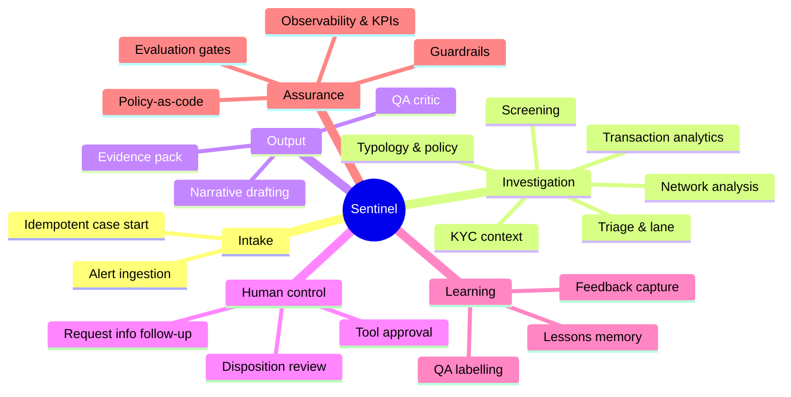
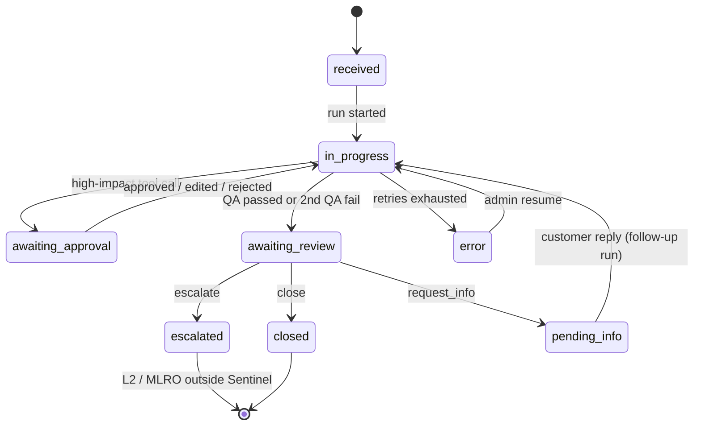

# Sentinel — Detailed Functional Specification

| Item     | Value                                                                                                                                                            |
| -------- | ---------------------------------------------------------------------------------------------------------------------------------------------------------------- |
| Document | 03 — Detailed Functionality                                                                                                                                     |
| Version  | 0.1 (Draft)                                                                                                                                                      |
| Author   | Rakesh Velayudhan                                                                                                                                                |
| Related  | [01 HLD](01_High_Level_Design.md) · [02 Technical Design](02_Technical_Design.md) · [04 Roadmap](04_Project_Roadmap.md) · [05 Task Plan](05_Project_Task_Plan.md) |

Requirement IDs: **FR-** functional, **BR-** business rule, **NFR-** non-functional, **UC-** use case. Priority: **M** = Must (MVP), **S** = Should (full squad), **C** = Could (stretch).

---

## 1. Actors and roles

| Actor           | Type                     | Permissions in Sentinel                                                |
| --------------- | ------------------------ | ---------------------------------------------------------------------- |
| TM system       | System                   | Publishes alerts                                                       |
| Sentinel agents | System                   | Read via MCP tools; write draft narrative and agent status only        |
| L1 analyst      | Human (`l1`)           | View fast-lane cases; decide close / escalate / request_info           |
| L2 investigator | Human (`l2`)           | View all cases; decide; edit SAR draft; approve customer info requests |
| MLRO            | Human (outside Sentinel) | Decides SAR filing in case management                                  |
| QA reviewer     | Human (`qa`)           | Label sampled cases; score rubric                                      |
| FinCrime SME    | Human (`sme`)          | Approve lessons; maintain typologies, rubrics, golden set              |
| Model risk      | Human                    | Approve material changes (CI step)                                     |
| Platform admin  | Human (`admin`)        | Config, replays, DLQ handling                                          |

---

## 2. Capability map

---

## 3. Use cases

### UC-01 Investigate a new alert (main flow)

| Field         | Detail                                                                                                                                                                                                                                                                                                                                                        |
| ------------- | ------------------------------------------------------------------------------------------------------------------------------------------------------------------------------------------------------------------------------------------------------------------------------------------------------------------------------------------------------------- |
| Primary actor | TM system → Sentinel                                                                                                                                                                                                                                                                                                                                         |
| Trigger       | Alert published to`aml.alerts.v1`                                                                                                                                                                                                                                                                                                                           |
| Precondition  | Case ID unique; customer exists                                                                                                                                                                                                                                                                                                                               |
| Main flow     | 1. Worker consumes the alert and starts a run (thread = case ID). 2. Triage sets the lane. 3. KYC, Transactions and Screening run in parallel. 4. Network runs if the lane is full. 5. Typology maps findings to typologies and policy. 6. Narrative drafts with evidence IDs. 7. QA checks. 8. Run pauses at human review; case status =`awaiting_review`. |
| Alternate     | 7a. QA fails → one rework of the named agent → QA again. 7b. QA fails twice → human review with issues attached.                                                                                                                                                                                                                                           |
| Exceptions    | Tool/model failure → retries → case`error` (resumable). Budget exceeded → human review flagged `incomplete`.                                                                                                                                                                                                                                           |
| Postcondition | Evidence pack + draft + recommendation available in the workbench                                                                                                                                                                                                                                                                                             |

### UC-02 Review and decide a case

| Field         | Detail                                                                                                                                                                                                                                                                 |
| ------------- | ---------------------------------------------------------------------------------------------------------------------------------------------------------------------------------------------------------------------------------------------------------------------- |
| Actor         | L1 analyst / L2 investigator                                                                                                                                                                                                                                           |
| Main flow     | 1. Opens a case from the queue. 2. Reviews the evidence pack, findings and draft. 3. Optionally edits the narrative. 4. Chooses close / escalate / request_info with a reason code and agreement flag. 5. Submits; the run resumes and ends; the decision is recorded. |
| Rules         | BR-08, BR-09, BR-10                                                                                                                                                                                                                                                    |
| Postcondition | `cases.decisions` row; case status updated; draft-vs-final diff logged as feedback                                                                                                                                                                                   |

### UC-03 Approve a high-impact tool call

Narrative agent wants to draft a customer information request → the run pauses → L2 approves, edits or rejects → the run continues. Output rails check for tipping-off language.

### UC-04 Follow up after "request info"

Customer reply arrives (simulated) → admin/investigator attaches it → a follow-up run starts on the child thread `{case_id}:r1` with prior state as context → normal flow from KYC onwards.

### UC-05 QA sampling and labelling

QA reviewer opens a sampled case → scores it against the rubric → the label is stored and feeds the golden dataset.

### UC-06 Approve a lesson

SME reviews proposed lessons (derived from feedback) → approves or rejects → active lessons become retrievable by agents in that entity/typology namespace.

### UC-07 Audit replay

Admin or auditor opens case history → steps through each checkpoint (state, tool calls, model, prompt version) → follows the trace link to Tempo.

### UC-08 Blocked forbidden action (security demo)

An injected instruction in adverse media tells an agent to "close this alert" → the agent attempts a forbidden or unlisted tool → OPA denies it → a security event is logged and counted → the case continues normally.

### UC-09 Release a change

Developer changes a prompt → PR → CI runs unit + golden + OPA tests → RC runs a LangSmith experiment + Promptfoo → gates pass → merge/deploy. Material change → model-risk approval.

### UC-10 Cross-entity check (C, A2A)

The UK Sentinel asks the Openbank Sentinel (A2A) whether a counterparty is a customer with open alerts. Only a yes/no plus case reference is returned. Conversation ID ↔ thread ID are mapped for tracing.

---

## 4. Functional requirements by module

### 4.1 Alert intake

| ID     | Requirement                                                                                                                                     | Pri |
| ------ | ----------------------------------------------------------------------------------------------------------------------------------------------- | --- |
| FR-001 | The system shall consume alerts from`aml.alerts.v1` and validate them against the alert schema. Invalid messages go to the DLQ.               | M   |
| FR-002 | The system shall start exactly one LangGraph run per case, using`case_id` as `thread_id`. Re-delivered alerts shall not start a second run. | M   |
| FR-003 | The system shall set case status`in_progress` at start and `awaiting_review` at the human pause.                                            | M   |
| FR-004 | The system shall provide`POST /cases` to inject alerts for demo/testing.                                                                      | M   |
| FR-005 | The system shall stamp each run with graph, prompt, model and policy versions.                                                                  | M   |

### 4.2 Triage agent

**Purpose:** classify the scenario and candidate typologies; choose the lane.

| ID     | Requirement                                                                                              | Pri |
| ------ | -------------------------------------------------------------------------------------------------------- | --- |
| FR-010 | Triage shall read the alert and the customer's case history (≤ 36 months).                              | M   |
| FR-011 | Triage shall apply the deterministic lane rules (BR-02) before the LLM step.                             | M   |
| FR-012 | The LLM may upgrade fast → full with a rationale. It shall not downgrade a rule-forced full lane.       | M   |
| FR-013 | Output:`TriageResult` with scenario, ≥ 1 typology candidate, lane, rule hits, rationale and evidence. | M   |

**Acceptance:** on the golden set, every case with a planted `MULE_RING`, `SANCT_NEAR` (true) or `PEP` typology is routed to full (100%).

### 4.3 KYC context agent

| ID     | Requirement                                                                                                                                 | Pri |
| ------ | ------------------------------------------------------------------------------------------------------------------------------------------- | --- |
| FR-020 | Retrieve the customer profile, risk rating, occupation/business purpose, accounts and expected activity.                                    | M   |
| FR-021 | Compare expected vs actual activity (volumes, cash share, countries) over the alert look-back window and list discrepancies with magnitude. | M   |
| FR-022 | Summarise relevant CRM notes. Notes are treated as untrusted data (input rails).                                                            | M   |
| FR-023 | Output:`KycFindings` with evidence IDs for every discrepancy.                                                                             | M   |

### 4.4 Transaction analytics agent

| ID     | Requirement                                                                                                       | Pri |
| ------ | ----------------------------------------------------------------------------------------------------------------- | --- |
| FR-030 | Retrieve transactions for the alerted accounts over the look-back window (bounded).                               | M   |
| FR-031 | Compute velocity stats (count/sum per 1/7/30 days).                                                               | M   |
| FR-032 | Detect structuring: ≥ N cash deposits within X% below the threshold in a window (defaults: N=3, X=10%, 14 days). | M   |
| FR-033 | Detect pass-through: inbound matched by ≥ 80% outbound within 48 h.                                              | M   |
| FR-034 | Compare against peer-segment baselines (percentile).                                                              | M   |
| FR-035 | Output:`TxnFindings` with red flags, each referencing transaction evidence IDs.                                 | M   |

### 4.5 Screening agent

| ID     | Requirement                                                                                                              | Pri |
| ------ | ------------------------------------------------------------------------------------------------------------------------ | --- |
| FR-040 | Re-screen the customer, related directors/UBOs and key counterparties against the sanctions and PEP lists (fuzzy match). | M   |
| FR-041 | For each hit, assess true vs false match using DOB, country and aliases, with a reason.                                  | M   |
| FR-042 | Search adverse media. Article text passes input rails before reaching the model.                                         | M   |
| FR-043 | Look up company registry data for corporate customers/counterparties.                                                    | S   |
| FR-044 | Output:`ScreeningFindings` with list-entry and article evidence IDs.                                                   | M   |

### 4.6 Network agent (full lane only)

| ID     | Requirement                                                                              | Pri |
| ------ | ---------------------------------------------------------------------------------------- | --- |
| FR-050 | Expand the customer's neighbourhood up to 2 hops and 50 nodes via template queries only. | S   |
| FR-051 | Identify shared devices and their customers.                                             | S   |
| FR-052 | Read precomputed community IDs and mule scores; never trigger algorithm runs per case.   | S   |
| FR-053 | Output:`NetworkFindings` with related parties, mule score and evidence IDs.            | S   |

### 4.7 Typology & policy agent

| ID     | Requirement                                                                                                          | Pri                            |
| ------ | -------------------------------------------------------------------------------------------------------------------- | ------------------------------ |
| FR-060 | Map combined findings to typologies from the catalogue (§7) with a confidence for each.                             | S (M: simplified rules in MVP) |
| FR-061 | Retrieve the applicable procedure for the case's legal entity via hybrid search; cite`policy_version` and section. | S                              |
| FR-062 | Produce a risk score (0–100) and a**recommendation** (close / escalate / request_info) with rationale.        | M                              |
| FR-063 | Output:`TypologyAssessment` with policy evidence IDs.                                                              | M                              |

> MVP note: before `policy_kb` exists, the recommendation is produced by a rules + Sonnet step inside the narrative stage, using the typology catalogue embedded in the prompt.

### 4.8 Narrative agent

| ID     | Requirement                                                                                       | Pri |
| ------ | ------------------------------------------------------------------------------------------------- | --- |
| FR-070 | Draft an L1 rationale (fast lane) or an L2 SAR-style narrative (full lane).                       | M   |
| FR-071 | Structure the draft as claims. Every claim cites ≥ 1 evidence ID present in state.               | M   |
| FR-072 | Use neutral, factual language. No legal conclusions; no customer-facing content except via UC-03. | M   |
| FR-073 | Save the draft via`save_draft_narrative` (versioned).                                           | M   |
| FR-074 | Use Opus for full/L2 and Sonnet for fast/L1 (configurable).                                       | M   |
| FR-075 | Use redacted prior SAR examples only as style guidance.                                           | C   |

**Narrative template (L2):** Summary · Subject(s) · Alert & scenario · Activity analysed · Red flags (with evidence) · Screening results · Network (if any) · Typology & policy reference · Recommendation · Open questions.

### 4.9 QA critic

| ID     | Requirement                                                                      | Pri |
| ------ | -------------------------------------------------------------------------------- | --- |
| FR-080 | Run the code citation check (every claim cited; every ID exists).                | M   |
| FR-081 | Check completeness against the lane checklist (BR-05).                           | M   |
| FR-082 | Check policy rules (e.g. a true sanctions match must recommend escalate).        | M   |
| FR-083 | Emit issues with target agent and severity. Set`passed`.                       | M   |
| FR-084 | Use a model/tier different from the narrative agent's.                           | M   |
| FR-085 | Allow at most one rework. A second failure goes to human review with the issues. | M   |

### 4.10 Human review & disposition

| ID     | Requirement                                                                             | Pri |
| ------ | --------------------------------------------------------------------------------------- | --- |
| FR-090 | Pause every run at`human_review` with the full evidence pack payload.                 | M   |
| FR-091 | Allowed actions: close, escalate, request_info. Each requires a reason code.            | M   |
| FR-092 | Capture investigator ID, timestamp, edits and the "agree with recommendation" flag.     | M   |
| FR-093 | Persist the paused state indefinitely (days/weeks) and resume exactly where it stopped. | M   |
| FR-094 | Reject decisions from unauthorised roles (L1 cannot decide full-lane cases).            | M   |
| FR-095 | Log the draft-vs-final narrative diff as feedback.                                      | S   |
| FR-096 | Support request_info follow-up runs (UC-04).                                            | S   |

### 4.11 Investigator workbench

| ID     | Requirement                                                                                      | Pri |
| ------ | ------------------------------------------------------------------------------------------------ | --- |
| FR-100 | Queue view with filters (status, lane, entity, age) and SLA indicators.                          | M   |
| FR-101 | Case view: overview, evidence pack, findings per agent, narrative with clickable evidence chips. | M   |
| FR-102 | Live progress via SSE while the case is running.                                                 | M   |
| FR-103 | Decision panel (FR-091/092).                                                                     | M   |
| FR-104 | Network graph visualisation for full-lane cases.                                                 | S   |
| FR-105 | Audit timeline (checkpoint history + trace link).                                                | S   |
| FR-106 | QA labelling screen with rubric.                                                                 | S   |
| FR-107 | Blind mode: a configurable % of cases shown without draft/recommendation.                        | S   |
| FR-108 | Tool-approval dialog (UC-03).                                                                    | S   |
| FR-109 | PII shown unmasked only to authorised roles.                                                     | M   |

### 4.12 Memory & learning

| ID     | Requirement                                                              | Pri |
| ------ | ------------------------------------------------------------------------ | --- |
| FR-110 | Generate proposed lessons from decisions and feedback.                   | C   |
| FR-111 | SME approval workflow for lessons.                                       | C   |
| FR-112 | Agents retrieve the top 3 active lessons by entity + typology namespace. | C   |
| FR-113 | Reject any lesson containing customer identifiers (Presidio check).      | C   |

### 4.13 Guardrails & policy

| ID     | Requirement                                                                        | Pri |
| ------ | ---------------------------------------------------------------------------------- | --- |
| FR-120 | Deny-by-default OPA check on every tool call; denials logged as security events.   | M   |
| FR-121 | No agent shall have a tool to close, escalate, file a SAR or update customer data. | M   |
| FR-122 | Redact PII before model calls (configurable entity list).                          | M   |
| FR-123 | Scan tool outputs from external/free-text sources with input rails.                | S   |
| FR-124 | Output rails against tipping-off and legal conclusions.                            | S   |
| FR-125 | Enforce per-case token and tool-call budgets.                                      | M   |

### 4.14 Knowledge management

| ID     | Requirement                                                                | Pri |
| ------ | -------------------------------------------------------------------------- | --- |
| FR-130 | Ingest policy/typology documents with Docling; chunk by structure.         | S   |
| FR-131 | Tag chunks with entity, country, policy version and typology.              | S   |
| FR-132 | Re-ingest changed documents, keeping prior versions retrievable for audit. | S   |

### 4.15 Evaluation & release

| ID     | Requirement                                                                          | Pri |
| ------ | ------------------------------------------------------------------------------------ | --- |
| FR-140 | Golden dataset of ≥ 300 labelled synthetic cases (target 500), 20% held out.        | M   |
| FR-141 | CI runs the DeepEval golden suite; failing gates block merge.                        | M   |
| FR-142 | LangSmith experiment compares an RC to the production baseline on a ~200-case slice. | M   |
| FR-143 | Promptfoo red-team suite (injection, tipping-off, privilege escalation, PII leak).   | M   |
| FR-144 | Ragas retrieval evaluation on policy Q&A.                                            | S   |

### 4.16 Observability & reporting

| ID     | Requirement                                                                      | Pri |
| ------ | -------------------------------------------------------------------------------- | --- |
| FR-150 | Trace every node/tool/model call via OTel to Tempo with the standard attributes. | M   |
| FR-151 | Expose Prometheus metrics (TDD §16.2).                                          | M   |
| FR-152 | Grafana platform dashboard and business KPI dashboard.                           | M   |
| FR-153 | Alert rules for drift, agreement, fairness, injection, cost, backlog.            | S   |

### 4.17 Administration

| ID     | Requirement                                                              | Pri |
| ------ | ------------------------------------------------------------------------ | --- |
| FR-160 | Replay/resume a failed case from its last checkpoint.                    | M   |
| FR-161 | View and requeue DLQ messages.                                           | S   |
| FR-162 | Configure lane thresholds, budgets and blind-mode % without code change. | S   |

---

## 5. Lane selection and case lifecycle

### 5.1 Case state machine

---

## 6. Business rules catalogue

| ID    | Rule                                                                                                                                                                                                                                                                                                                                                                                  |
| ----- | ------------------------------------------------------------------------------------------------------------------------------------------------------------------------------------------------------------------------------------------------------------------------------------------------------------------------------------------------------------------------------------- |
| BR-01 | Agents never make dispositions. Only humans close, escalate or request info.                                                                                                                                                                                                                                                                                                          |
| BR-02 | **Full lane is forced** if any of these hold: customer risk rating = high; any sanctions/PEP indication in the alert; alert amount ≥ full-lane threshold (default 50,000 in the entity's currency); ≥ 2 prior alerts in 12 months; scenario is network-type (mule/fan-in/fan-out); multiple customers on the alert. Otherwise fast lane, unless the LLM upgrades it (FR-012). |
| BR-03 | Network analysis is limited to ≤ 2 hops and ≤ 50 nodes per case.                                                                                                                                                                                                                                                                                                                    |
| BR-04 | Every narrative claim must cite ≥ 1 evidence ID present in case state (100%).                                                                                                                                                                                                                                                                                                        |
| BR-05 | **Completeness checklist.** Fast lane: KYC, Txn and Screening findings present; recommendation present. Full lane: the above + Network findings + ≥ 1 policy reference.                                                                                                                                                                                                        |
| BR-06 | A confirmed true sanctions match must produce recommendation = escalate. QA blocks otherwise.                                                                                                                                                                                                                                                                                         |
| BR-07 | QA may trigger at most one rework per case.                                                                                                                                                                                                                                                                                                                                           |
| BR-08 | L1 users may decide only fast-lane cases. Full-lane cases require L2.                                                                                                                                                                                                                                                                                                                 |
| BR-09 | Every decision requires a reason code from the configured list.                                                                                                                                                                                                                                                                                                                       |
| BR-10 | A decision is accepted only when the case is`awaiting_review`.                                                                                                                                                                                                                                                                                                                      |
| BR-11 | Customer-facing drafts must not reveal suspicion or the existence of an investigation (tipping-off).                                                                                                                                                                                                                                                                                  |
| BR-12 | Customer facts are never stored in long-term memory.                                                                                                                                                                                                                                                                                                                                  |
| BR-13 | Agents only see policy chunks for their own legal entity.                                                                                                                                                                                                                                                                                                                             |
| BR-14 | Production data never goes to LangSmith. Dev uses synthetic/anonymised data only.                                                                                                                                                                                                                                                                                                     |
| BR-15 | A model upgrade or new tool is a material change and needs model-risk approval.                                                                                                                                                                                                                                                                                                       |

---

## 7. Typology catalogue (portfolio)

| Code      | Name                               | Key red flags                                                  | Typical lane     |
| --------- | ---------------------------------- | -------------------------------------------------------------- | ---------------- |
| STRUCT    | Structuring / smurfing             | Repeated cash deposits just below threshold; multiple branches | Fast → escalate |
| PASSTHRU  | Rapid pass-through                 | In ≈ out within 48 h; low retained balance                    | Fast/Full        |
| MULE_RING | Money mule network                 | Shared devices; fan-in from many → fan-out; new accounts      | Full             |
| HRJ       | High-risk jurisdiction             | Flows to/from high-risk countries inconsistent with profile    | Fast/Full        |
| SANCT     | Sanctions exposure                 | True match on a sanctions list (customer/counterparty)         | Full             |
| PEP       | PEP / unexplained wealth           | PEP link; activity above declared wealth                       | Full             |
| PROFILE   | Activity inconsistent with profile | Volumes far above expected; new products                       | Fast             |
| TBML      | Trade-based laundering             | Invoice mismatches, unusual goods/routes                       | Full (C)         |

---

## 8. Evidence pack contents

| Section       | Content                                                               | Source agent |
| ------------- | --------------------------------------------------------------------- | ------------ |
| Alert         | Scenario, score, triggering transactions                              | Triage       |
| Lane decision | Lane, rule hits, rationale                                            | Triage       |
| Customer      | Profile, risk rating, purpose, expected vs actual                     | KYC          |
| Activity      | Metrics, red flags, flagged transactions                              | Transactions |
| Screening     | Hits with match assessment, media, registry                           | Screening    |
| Network       | Related parties, shared devices, mule score                           | Network      |
| Assessment    | Typologies, policy references (versioned), risk score, recommendation | Typology     |
| Narrative     | Claims with evidence chips                                            | Narrative    |
| QA            | Checklist results, issues, rework history                             | QA           |
| Audit         | Versions, trace ID, checkpoint history                                | System       |

Evidence ID formats: `txn:<id>`, `acct:<id>`, `cust:<id>`, `list:<list>:<entry>`, `media:<article>`, `reg:<company>`, `graph:<node|community>`, `policy:<doc>@<version>#<section>`, `crm:<note>`, `case:<prior case>`.

---

## 9. Reason codes (initial)

| Action       | Codes                                                                                                                                                   |
| ------------ | ------------------------------------------------------------------------------------------------------------------------------------------------------- |
| close        | `FP_EXPLAINED_ACTIVITY`, `FP_SCREENING_FALSE_MATCH`, `FP_KNOWN_BUSINESS_PATTERN`, `FP_DATA_ERROR`                                               |
| escalate     | `STRUCTURING_CONFIRMED`, `PASS_THROUGH`, `MULE_NETWORK`, `SANCTIONS_TRUE_MATCH`, `PEP_UNEXPLAINED`, `PROFILE_MISMATCH`, `OTHER_SUSPICION` |
| request_info | `SOURCE_OF_FUNDS`, `BUSINESS_PURPOSE`, `COUNTERPARTY_RELATIONSHIP`                                                                                |

---

## 10. Reports and dashboards

| Dashboard     | Widgets                                                                                                                                                              |
| ------------- | -------------------------------------------------------------------------------------------------------------------------------------------------------------------- |
| Business KPIs | Alerts/day; handling time (start → decision); evidence-complete %; agreement rate (alarm band 80–98%); QA failure rate; cost per alert; escalation rate by segment |
| Platform      | Cases in progress; latency p50/p95 by lane; node durations; error rate; Kafka lag; Bedrock throttles; MCP latency                                                    |
| Security      | Tool denials by agent/tool; injection detections by source; PII redaction counts                                                                                     |
| Evaluation    | Golden-set scores per release; red-team pass rate; Ragas metrics trend                                                                                               |

---

## 11. Non-functional requirements

| ID     | Category        | Requirement (portfolio target)                                                       |
| ------ | --------------- | ------------------------------------------------------------------------------------ |
| NFR-01 | Performance     | Fast lane ≤ 3 min p95; full lane ≤ 10 min p95 to`awaiting_review` (illustrative) |
| NFR-02 | Throughput      | Process 300 alerts/day locally with 3 workers; architecture scales horizontally      |
| NFR-03 | Durability      | Zero lost cases on worker kill (chaos test)                                          |
| NFR-04 | Availability    | API ≥ 99.5% (REF); restart-safe locally                                             |
| NFR-05 | Auditability    | 100% of steps checkpointed; full replay of any case                                  |
| NFR-06 | Traceability    | 100% of spans tagged with case, entity, lane, prompt version, model                  |
| NFR-07 | Explainability  | 100% of narrative claims backed by valid evidence                                    |
| NFR-08 | Security        | Deny-by-default tool policy; no write tools beyond drafts; secrets never in Git      |
| NFR-09 | Privacy         | PII redacted before model calls; no prod data to third parties                       |
| NFR-10 | Data residency  | [REF] EU inference profiles; one deployment per legal entity                         |
| NFR-11 | Cost            | Per-case budget configurable; average cost reported per lane                         |
| NFR-12 | Quality         | Escalation recall ≥ 0.95 on golden set (to be baselined); agreement 80–98%         |
| NFR-13 | Maintainability | Prompts, policies and models versioned; ≥ 70% unit-test coverage on non-LLM code    |
| NFR-14 | Portability     | MCP servers usable by any MCP client; model provider switchable via config           |
| NFR-15 | Usability       | Investigator can decide a case without leaving the workbench                         |

---

## 12. Traceability matrix (excerpt)

| Requirement           | Verified by                                                              |
| --------------------- | ------------------------------------------------------------------------ |
| FR-002, NFR-03        | Integration test: duplicate alert; chaos test killing the worker mid-run |
| FR-012, BR-02         | Unit tests on lane rules; golden-set lane accuracy                       |
| FR-071, BR-04, NFR-07 | Citation code check in CI (100%)                                         |
| FR-085, BR-07         | Graph test forcing two QA failures                                       |
| FR-090–094           | API + workbench E2E tests (Playwright)                                   |
| FR-120/121, UC-08     | `opa test`; Promptfoo privilege-escalation suite; demo scenario        |
| FR-122                | Presidio unit tests; trace inspection for PII                            |
| FR-124, BR-11         | Promptfoo tipping-off suite                                              |
| FR-141/142            | CI eval-gate workflow; LangSmith experiment report                       |
| NFR-12                | DeepEval golden suite report                                             |

---

## 13. Out of scope

- Real customer data or connections to real bank systems.
- SAR filing to any regulator; MLRO workflow.
- Transaction-monitoring rule tuning (Sentinel consumes alerts; it does not generate them).
- Multi-language narratives (policies may be multilingual; narratives are English in the portfolio build).
