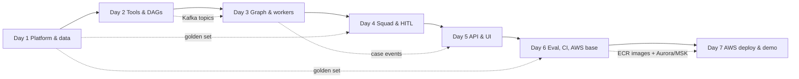

# Sentinel — Project Roadmap (1-Week Build)

| Item | Value |
|---|---|
| Document | 04 — Project Roadmap |
| Version | 0.4 (7-day build with Kafka, Airflow, AWS, extended HITL and full workbench) |
| Author | Rakesh Velayudhan |
| Related | [01 HLD](01_High_Level_Design.md) · [02 Technical Design](02_Technical_Design.md) · [03 Functional Spec](03_Functional_Specification.md) · [05 Task Plan](05_Project_Task_Plan.md) |

---

## 1. Planning assumptions

- **Duration:** 7 consecutive days, **Day 1 → Day 7**. The demo is at the end of Day 7.
- **Way of working:** AI pair-programming. The AI drafts code, tests and Terraform. The developer reviews, runs, debugs and decides. Estimates assume this pace (about 10–12 focused hours a day).
- **Approach:** one phase per day, each ending with a **daily gate**. If a gate fails, the next morning starts by closing the gap. Only items on the [cut line](#7-cut-line-what-to-drop-first-if-behind) may be dropped. Demo-critical items are never dropped.
- **Environments:** local Docker Compose for development (with the **locally installed Neo4j**). AWS "managed-lite" ([TDD §19.3](02_Technical_Design.md#193-demo-aws-managed-lite-deployment-1-week-build)) for the demo.
- **Source control:** GitHub remote with Actions for CI, the eval gate and deployment.
- **Data:** synthetic only. Bedrock access (or the Anthropic API fallback) must work on Day 1.
- Record any re-plan in the [Task Plan change log](05_Project_Task_Plan.md#change-log).

---

## 2. Demo commitments (end of Day 7)

These must be demonstrable at the end of Day 7:

| # | Demo item | Shown via |
|---|---|---|
| 1 | Alert arrives on **Kafka** → agent squad investigates → case waits for a human | Airflow `alert_replay` DAG → Kafka UI → workbench live progress |
| 2 | Investigator reviews the evidence pack and decides | Workbench case view + decision panel (decision flows back via `aml.decisions.v1`) |
| 3 | **Airflow** batch jobs | DAGs: sanctions refresh, graph rebuild (mule scores), policy re-embed, alert replay, nightly eval |
| 4 | **Tool-approval HITL** (UC-03) | Narrative agent drafts a customer information request → approval dialog → approve/edit/reject |
| 5 | **Request-info follow-up** (UC-04) | Decision "request_info" → customer reply attached → follow-up run on the child thread |
| 6 | **Workbench screens** | Queue, case view, network graph, audit timeline, approval dialog, request-info/reply, QA labelling (+ blind mode) |
| 7 | Forbidden action blocked (UC-08) | Injected "close this alert" → OPA deny → security panel in Grafana |
| 8 | Release gate (UC-09) | Degraded-prompt PR blocked in GitHub Actions |
| 9 | Observability | Tempo trace of a case; Grafana platform/KPI/security dashboards |
| 10 | **Running on AWS** | ECS Fargate + MSK Serverless + Aurora Serverless v2 + Bedrock, deployed by GitHub Actions |

---

## 3. Scope

### 3.1 In scope

| Area | What ships |
|---|---|
| Data | Synthetic generator with planted typologies; golden set of **100 cases** (20 held out) |
| Streaming | Kafka (KRaft locally, MSK Serverless on AWS): `aml.alerts.v1`, `aml.decisions.v1`, `aml.case-events.v1`, DLQ; alert and decision workers |
| Batch | Airflow 3 (`airflow standalone`, locally and on ECS) with 5 DAGs |
| Stores | Postgres/Aurora + pgvector; Neo4j (local install with GDS; AuraDB Free on AWS, see TDD Q7) |
| Tools | 6 FastMCP servers; OPA deny-by-default on every call |
| Agents | All 8 + QA rework loop |
| HITL | Disposition interrupt, tool-approval middleware (UC-03), request-info follow-up (UC-04) |
| Guardrails | Presidio PII, injection rail on tool outputs, citation guard, budgets |
| Product | FastAPI (incl. SSE) + React workbench with all screens in §2 |
| Assurance | DeepEval golden suite, Promptfoo red-team, LangSmith experiment (30-case slice), CI eval gate |
| Observability | OTel-only tracing → Tempo; Prometheus; Grafana dashboards |
| Cloud | Terraform for managed-lite AWS; GitHub Actions OIDC deploy |

### 3.2 After Day 7 (backlog)

NeMo Guardrails · Ragas · Cohere rerank · lessons memory (UC-06) · Debezium CDC · Iceberg · EKS/Helm/KEDA/Argo CD · MWAA · Network Firewall and WORM archive · image signing/SBOM · A2A (UC-10) · golden set to 300–500 cases.

---

## 4. Timeline

```mermaid
flowchart LR
    D1["Day 1<br/>Foundations, Kafka,<br/>Airflow, data"] --> G1{{G1 Platform &<br/>data ready}}
    G1 --> D2["Day 2<br/>MCP tools, OPA,<br/>Kafka + Airflow DAGs"] --> G2{{G2 Tools &<br/>pipelines ready}}
    G2 --> D3["Day 3<br/>Core graph, HITL,<br/>Kafka workers"] --> G3{{G3 Streaming<br/>E2E MVP}}
    G3 --> D4["Day 4<br/>Full squad, guardrails,<br/>extended HITL"] --> G4{{G4 Full squad +<br/>HITL flows}}
    G4 --> D5["Day 5<br/>API & full<br/>workbench"] --> G5{{G5 Complete<br/>workbench}}
    G5 --> D6["Day 6<br/>Eval, observability,<br/>CI, AWS foundation"] --> G6{{G6 Gated release<br/>+ AWS base}}
    G6 --> D7["Day 7<br/>AWS deploy,<br/>hardening, demo"] --> G7{{G7 Demo on<br/>AWS · v1.0}}
```

---

## 5. Day-by-day plan

### Day 1 — Foundations, Kafka, Airflow & synthetic data

- Monorepo, `uv`, pins, pre-commit, GitHub remote + branch protection on `main`.
- Docker Compose: **Kafka (KRaft) + Kafka UI**, Postgres+pgvector, OPA, **Airflow standalone**, OTel Collector, Tempo, Prometheus, Grafana.
- **Local Neo4j:** reachable from host and containers, GDS plugin checked, read-only dev user.
- **Neo4j MCP server** connected to the AI pair-programming tool for schema exploration and Cypher authoring. *Dev use only, with read-only credentials.* Agents never get a free-form Cypher tool (HLD principle P3, BR-03).
- Bedrock verified for 3 models; LangSmith dev project.
- Synthetic generator, loaders (Postgres, Neo4j), graph scores (GDS with `networkx` fallback), golden set.

**Gate G1:** `make up && make seed` from a clean clone. Kafka, Airflow, Grafana and Neo4j are all reachable. Planted patterns are visible. All 3 models respond.

### Day 2 — MCP tools, OPA, Kafka plumbing & Airflow DAGs

- Shared MCP library; servers `case_mgmt` (incl. `draft_customer_info_request`, `attach_customer_reply`), `kyc_profile`, `txn_history` (detectors), `screening`, `graph_query`.
- OPA policy + `opa test`; per-agent MCP client loading.
- Kafka topics, schema validation, alert producer CLI.
- Airflow DAGs that wrap the Day 1 scripts: `sanctions_refresh`, `graph_rebuild`, `alert_replay` (publishes golden alerts to Kafka).

**Gate G2:** tools return correct evidence IDs; tests and `opa test` pass; `alert_replay` puts alerts on `aml.alerts.v1`.

### Day 3 — Core agent graph, HITL & Kafka workers

- State + reducers, schemas, agent factory, prompts v1.
- Triage, KYC, Transactions, Screening, Narrative, QA (+ rework); Typology stub.
- `AsyncPostgresSaver`, `human_review` interrupt, OPA middleware.
- **Alert worker** (idempotent start, DLQ, publishes to `aml.case-events.v1`) and **decision worker** (resume after a `snapshot.next` check).

**Gate G3:** 10 alerts replayed through Kafka reach `awaiting_review` with 100% valid citations. A decision published to `aml.decisions.v1` completes the run.

### Day 4 — Full squad, guardrails & extended HITL

- Policy manuals → Docling → pgvector; `policy_kb` server; Airflow `policy_reembed` DAG.
- Network and Typology & policy agents.
- Presidio PII, injection rail, budgets, UC-08 forbidden-action demo.
- **UC-03:** `HumanInTheLoopMiddleware` on `draft_customer_info_request` + tipping-off check.
- **UC-04:** `request_info` → customer reply → follow-up run on `{case_id}:r1`.
- Baseline golden run (100 cases via `alert_replay` → Kafka).

**Gate G4:** all 8 agents; full-lane checklist passes; UC-03, UC-04 and UC-08 work from the CLI/API; baseline recorded.

### Day 5 — API & full workbench

- FastAPI: cases, decisions (→ Kafka), approvals, customer replies, QA labels, history, SSE from `aml.case-events.v1`; roles `l1`/`l2`/`qa`/`sme` with RBAC.
- React screens: queue, case view (evidence pack, narrative chips), decision panel, live progress, **network graph (Cytoscape)**, **audit timeline** (checkpoints + Tempo link), **tool-approval dialog**, **request-info / customer-reply**, **QA labelling**, blind mode.
- Playwright E2E for decide, approve and request-info flows.

**Gate G5:** demo items 1, 2, 4, 5 and 6 work end to end in the browser on the local stack.

### Day 6 — Evaluation, observability, CI & AWS foundation

- DeepEval (per-agent + golden suite with thresholds), Promptfoo red-team, LangSmith 30-case slice, G-Eval rubric.
- Airflow `nightly_eval` DAG (samples checkpoints, scores with a judge model, writes to Postgres → Grafana).
- OTel-only tracing → Tempo; Prometheus metrics; Grafana platform, KPI and security dashboards.
- GitHub Actions `ci.yml` + `eval-gate.yml`; degraded-prompt PR blocked.
- Production Dockerfiles; images pushed to ECR from CI.
- Terraform: network, ECR, Secrets Manager, IAM (incl. GitHub OIDC role), **Aurora Serverless v2**, **MSK Serverless**. **Apply** the foundation, because provisioning takes 20–40 minutes.

**Gate G6:** `make eval` passes; the regression PR is blocked; AWS foundation applied and reachable (Aurora + MSK + ECR).

### Day 7 — AWS deploy, hardening & demo

- Terraform ECS: cluster, Cloud Map, services (api, worker + OPA sidecar, 6 MCP, airflow, workbench, observability), ALB with IP allow-list.
- MSK IAM auth in the Kafka client; topic init task; Neo4j AWS target (Q7); migrations + seed task.
- `deploy.yml` (OIDC → ECR → ECS) and AWS smoke test of the full demo flow.
- Crash test, 100-alert load run, cost per case, security pass.
- Eval/KPI report, README, demo script, recording, docs updated to as-built.
- `terraform destroy` scheduled after the demo.

**Gate G7 (v1.0):** all 10 demo items are shown, with item 10 on AWS. Tag `v1.0`.

**AWS contingency:** if the AWS stack is not healthy by **mid-day on Day 7**, demo the end-to-end flow locally. On AWS, show the deployed foundation, the API/worker services and a Bedrock-backed case run, and log the gap.

---

## 6. Gate summary

| Gate | Day | Must be true |
|---|---|---|
| G1 Platform & data ready | Day 1 | Compose stack incl. Kafka + Airflow up; local Neo4j connected; data seeded; models reachable |
| G2 Tools & pipelines ready | Day 2 | Tools + OPA tests green; Airflow DAGs run; alerts land on Kafka |
| G3 Streaming E2E MVP | Day 3 | Kafka → graph → `awaiting_review` → Kafka decision → done, for 10 cases |
| G4 Full squad + HITL flows | Day 4 | 8 agents; UC-03/04/08 work; baseline recorded |
| G5 Complete workbench | Day 5 | All demo screens work locally; E2E tests pass |
| G6 Gated release + AWS base | Day 6 | Evals + CI gate working; dashboards live; Aurora/MSK/ECR applied |
| G7 Demo on AWS (v1.0) | Day 7 | Full demo on AWS (or contingency); docs as-built; `v1.0` tagged |

---

## 7. Cut line: what to drop first if behind

Drop items from the top first:

1. G-Eval narrative rubric
2. LangSmith experiment (DeepEval in CI stays the gate)
3. Blind mode
4. Docling (fall back to a Markdown header splitter)
5. SSE (poll every 2 s instead)
6. Presidio custom recognisers (keep built-in entities)
7. Airflow `nightly_eval` DAG (the other 4 DAGs stay)
8. Grafana panels beyond the KPI and security panels

**Never cut:** Kafka, Airflow (4 core DAGs), AWS deployment (or its contingency), UC-03, UC-04, demo workbench screens, human-in-the-loop, OPA, citation guard, golden-set evaluation, synthetic-only data.

---

## 8. Scope deviations from the Functional Spec / TDD

| Ref | Original | 1-week build |
|---|---|---|
| FR-140 | ≥ 300 golden cases | 100 cases (20 held out) |
| FR-142 | ~200-case LangSmith slice | 30-case slice |
| FR-123/124 | NeMo Guardrails rails | Lightweight classifier/regex rails |
| FR-110–113 | Lessons memory | Backlog |
| NFR-02 | 300 alerts/day, 3 workers | 100-alert load run; workers scale via ECS desired count |
| NFR-13 | ≥ 70% coverage | Tests on critical paths |
| TDD §19.2 | EKS, MWAA, MSK provisioned, Network Firewall | Managed-lite: ECS Fargate, Airflow container, MSK Serverless, Aurora Serverless v2 (TDD §19.3) |
| TDD §19.1 | Neo4j container | Locally installed Neo4j |

---

## 9. Risks for the 7 days

| Risk | Impact | Mitigation |
|---|---|---|
| Days are dense (~10–12 h) | Slip | AI drafts boilerplate; cut line; Must items first each day |
| MSK Serverless IAM auth with `aiokafka` | AWS Kafka blocked on Day 7 | Prototype the IAM token provider on Day 6 once MSK is up; contingency plan in §5 |
| AWS provisioning time / quotas | Day 7 slip | Apply the foundation on Day 6; small Fargate sizes; check service quotas at the start of Day 6 |
| AWS cost overrun | Budget | Apply only from Day 6; `terraform destroy` right after the demo; ~$25–30/day estimate |
| Neo4j in AWS (no GDS on AuraDB Free) | Missing mule scores | `networkx` fallback in `graph_scores.py` from Day 1 |
| Bedrock access not ready on Day 1 | Blocks Day 3 onwards | Anthropic API fallback via config |
| Airflow 3 setup friction | Day 1/Day 2 slip | `airflow standalone` (single container); DAGs only wrap existing scripts |
| LangGraph 1.2 / MCP adapter surprises | Rework | Version pins; TDD §22 corrections applied |
| Day 5 workbench scope is large | Day 5 slip | Shared components; graph and timeline views read existing API data; blind mode on the cut line |

---

## 10. Reference: enterprise roadmap (from the source design)

For a real bank, the source design plans **15–26 months**: Phase 0 Discovery (6–8 wks) → Phase 1 Shadow MVP (12–16 wks) → Phase 2 Assist pilot (3–6 months) → Phase 3 Scale (6–12 months), with about 14 people and go/no-go gates with FinCrime operations and model risk. This 1-week build is a working proof of the architecture covering roughly Phase 1–2 functionality on synthetic data, deployed to a lean AWS footprint.

---

## 11. Dependencies

